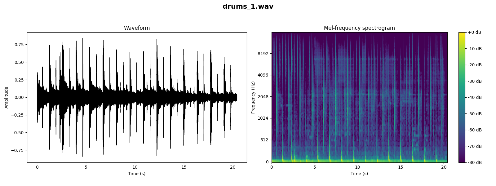
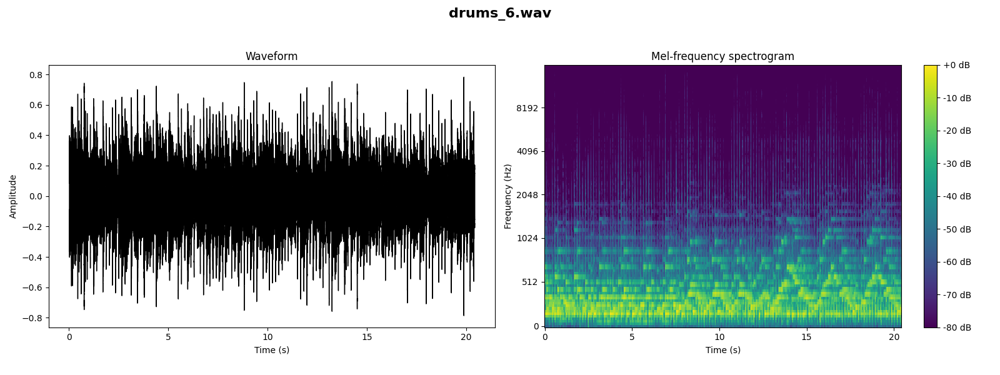
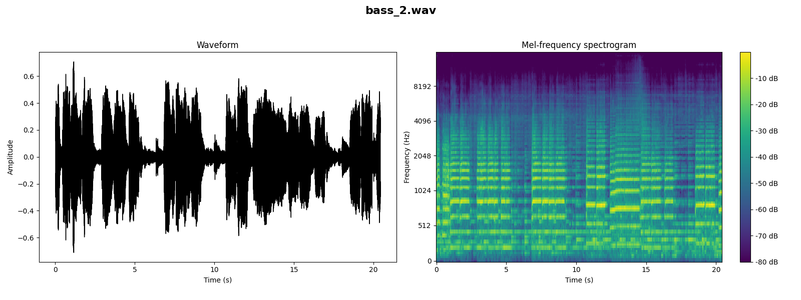
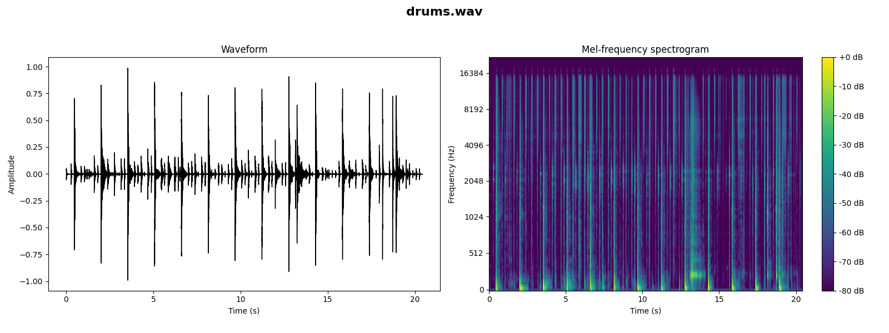

[Go to Prompt1](#prompt1) [Go to Prompt2](#prompt2) [Go to Prompt3](#prompt3)

<h2 id=prompt1>Prompt 1</h2>  
[Go to Prompt selection](#prompt)  
  
A traditional blues track featuring a slow, soulful tempo. The song should be built around a 12-bar blues structure with prominent electric guitar riffs and a harmonica. Background should include a steady bass line and a minimalist drum beat to enhance the melancholic yet resilient spirit of blues.

<audio controls>
  <source src="initial_prompt1.wav" type="audio/wav">
Your browser does not support the audio element.
</audio>

## Stem Content

### Prompt 1 - Drums stem
[Go to Prompt 1](#prompt1)  
instrumental. medium with a hip-hop beat with steady drumming, cymbals crashing, tambourine percussions, and a male voice chanting the same phrase. The audio quality is poor.
an electro song that consists of a low pitched male vocal talking, after which there is a punchy kick and snare hits, shimmering cymbals and groovy bass guitar. energetic and addictive.   

<audio controls>
  <source src="stem1/drums.wav" type="audio/wav">
Your browser does not support the audio element.
</audio>

### Prompt 1 - Bass stem
[Go to Prompt 1](#prompt1)  
An electric guitar melody played over playback instrumental. The recording is noisy and in mono.
An electric guitar melody playing. The recording is noisy and in mono.

<audio controls>
  <source src="stem1/bass.wav" type="audio/wav">
Your browser does not support the audio element.
</audio>

### Prompt 1 - Other stem
[Go to Prompt 1](#prompt1)  
a passionate electric guitar melody playing in the background. emotional and passionate. The recording is noisy and in mono.
an electric guitar melody. mellow, chill and easygoing.
   

<audio controls>
  <source src="stem1/other.wav" type="audio/wav">
Your browser does not support the audio element.
</audio>

### Prompt 1 - Vocals stem
[Go to Prompt 1](#prompt1)  
a woodblock one shot. The recording is noisy and in mono.
a woodblock one shot. The recording is noisy and in mono.
   

<audio controls>
  <source src="stem1/vocals.wav" type="audio/wav">
Your browser does not support the audio element.
</audio>

## Iterations

### Drums Iterations
#### Prompt 1 - Drums Iteration 1
[Go to Prompt 1](#prompt1)  
a hip hop song that consists of a low pitched female vocal talking over punchy kick and snare hits, low toms, shimmering hi hats, groovy bass and synth keys melody. chill and easygoing.
This song contains someone scratching over a hip hop beat with a lot of scratching. This is an amateur recording.
 

<audio controls>
  <source src="iterations1/drums_1.wav" type="audio/wav">
Your browser does not support the audio element.
</audio>

#### Prompt 1 - Drums Iteration 2
[Go to Prompt 1](#prompt1) 
The song is an instrumental. medium with a groovy bass line, steady drumming rhythm, keyboard accompaniment and various percussion hits. The song is youthful and groovy. The audio quality is average.
  
 
   

<audio controls>
  <source src="iterations1/drums_2.wav" type="audio/wav">
Your browser does not support the audio element.
</audio>

#### Prompt 1 - Drums Iteration 3
[Go to Prompt 1](#prompt1) 
an electro song that consists of a punchy kick, buzzy synth bass, claps and shimmering hi-hats. exciting and a bit too digital.
an electro song that consists of a punchy kick, buzzy synth bass, claps and shimmering hi-hats. groovy and the recording is noisy.
   
   

<audio controls>
  <source src="iterations1/drums_3.wav" type="audio/wav">
Your browser does not support the audio element.
</audio>

#### Prompt 1 - Drums Iteration 4
[Go to Prompt 1](#prompt1) 
a drum cover of a pop song that consists of energetic tom rolls, shimmering cymbals and punchy kick and snare hits. energetic and exciting.
a drum cover of a pop song that consists of energetic tom rolls, shimmering cymbals and punchy kick and snare hits. energetic and exciting.
  
   

<audio controls>
  <source src="iterations1/drums_4.wav" type="audio/wav">
Your browser does not support the audio element.
</audio>

#### Prompt 1 - Drums Iteration 5
[Go to Prompt 1](#prompt1) 
This is an industrial metal/alternative metal music piece. There is a male vocalist singing melodically in the lead. The main tune is being played by the keyboard and the electric guitar while the bass guitar are playing in the background. The rhythm is provided by a fast tempo acoustic drum beat. The atmosphere is aggressive. This piece could be played at nightclubs or dance clubs.
This clip features a drum solo. The kick is played on the cowbell. The snare is played continuously on the first count of the song. After four bars, the percussion plays a simple beat. The bass plays a groovy bassline. There are no voices in this song. This song can be played in a video game.
    
   

<audio controls>
  <source src="iterations1/drums_5.wav" type="audio/wav">
Your browser does not support the audio element.
</audio>

#### Prompt 1 - Drums Iteration 6
[Go to Prompt 1](#prompt1) 
This clip features a drum solo being played on a rock drum kit. The snare, kick, toms, hi-hat and splash are being struck. A pattern is played on this percussion. There are no other instruments in this song. There is no voice in this clip. This song can be played in a drum instruction video.
a cover of a rock song and it consists of a flat male vocal talking, followed by punchy kick and snare hits. energetic and the recording is noisy and in mono.
   

<audio controls>
  <source src="iterations1/drums_6.wav" type="audio/wav">
Your browser does not support the audio element.
</audio>

#### Prompt 1 - Drums Iteration 7
[Go to Prompt 1](#prompt1) 
someone playing a drum set with a fill-ins on the backbeat. A e-guitar is playing a countermelody in a higher register along with a drum stick hit. This song may be playing live at a festival.
 
   

<audio controls>
  <source src="iterations1/drums_7.wav" type="audio/wav">
Your browser does not support the audio element.
</audio>

#### Prompt 1 - Drums Iteration 8
[Go to Prompt 1](#prompt1) 
an electric guitar melody played over playback that consists of groovy bass, shimmering hi hats and snare hits. There are some crowd noises in the background. The recording is noisy and in mono.
an arpeggiated electric guitar melody. The recording is noisy and in mono.

   

<audio controls>
  <source src="iterations1/drums_8.wav" type="audio/wav">
Your browser does not support the audio element.
</audio>

#### Prompt 1 - Drums Iteration 9
[Go to Prompt 1](#prompt1) 
someone playing a melody on a theremin. This is an amateur recording. This song may be playing in a church.
someone playing a very fast snare drum-roll. This is an amateur recording. You can hear clicking and recording noises. This audio may be playing in a theater.
   

<audio controls>
  <source src="iterations1/drums_9.wav" type="audio/wav">
Your browser does not support the audio element.
</audio>

#### Prompt 1 - Drums Iteration 10
[Go to Prompt 1](#prompt1) 
a cover of a rock song and it consists of a flat male vocal singing over acoustic rhythm guitar chords. The recording is noisy and in mono.
a cover of a rock song and it consists of a flat male vocal singing over acoustic rhythm guitar chords. The recording is noisy, in mono and passionate and emotional. 
   

<audio controls>
  <source src="iterations1/drums_10.wav" type="audio/wav">
Your browser does not support the audio element.
</audio>

### Bass Iterations
#### Prompt 1 - Bass Iteration 1
[Go to Prompt 1](#prompt1) 
instrumental. fast with an enthusiastic electric guitar riff. muffled, punchy, buoyant and vibrant. The audio quality is poor with ambient sounds of people clapping and cheering.
instrumental. medium with a ukelelele rhythm. droning, rhythmic, deep and has a tribal feel. The audio quality is poor.

   

<audio controls>
  <source src="iterations1/bass_1.wav" type="audio/wav">
Your browser does not support the audio element.
</audio>

#### Prompt 1 - Bass Iteration 2
[Go to Prompt 1](#prompt1) 
an instrumental. medium with a lively accordion harmony, tuba and other stringed instruments. playful, cheerful, happy, joyful and animated.
someone playing a melody on a synthesizer in the mid- to higher register. A tambourine is playing a short melody on top in a higher key. This song may be playing in a meditation session.
   

<audio controls>
  <source src="iterations1/bass_2.wav" type="audio/wav">
Your browser does not support the audio element.
</audio>

#### Prompt 1 - Bass Iteration 3
[Go to Prompt 1](#prompt1) 
a live performance of a folk song and it consists of harmonica solo melody over groovy double bass and arpeggiated acoustic guitar melody. passionate and emotional.
a cover of a blues song and it consists of harmonica solo melody played over groovy double bass and shimmering hi-hats. The recording is noisy and in mono.
 
   

<audio controls>
  <source src="iterations1/bass_3.wav" type="audio/wav">
Your browser does not support the audio element.
</audio>

#### Prompt 1 - Bass Iteration 4
[Go to Prompt 1](#prompt1) 
instrumental. slow with a harmonica playing the main melody. soft, mellow, euphonious, dreamy, sentimental and romantic. Classical Instrumental.
a harmonica solo melody playing. The recording is noisy, in mono and emotional and passionate.

   

<audio controls>
  <source src="iterations1/bass_4.wav" type="audio/wav">
Your browser does not support the audio element.
</audio>

#### Prompt 1 - Bass Iteration 5
[Go to Prompt 1](#prompt1) 
wedding march that belongs to Scottish folk music. It is an instrumental piece. The tune is being played by the French bagpipes at a medium-to-high pitch. The atmosphere is cheerful. This piece could be playing at a Scottish wedding. It could also be included in the soundtrack of a historical drama movie during wedding scenes.
gospel music piece. There is a female vocalist singing melodically in the lead. The tune is being played by a clarinet while the bass guitar plays in the background. The atmosphere is religious. This piece could be used in the soundtrack of a historical drama movie during the scenes where the characters are reminiscing about the good old days.
 
   

<audio controls>
  <source src="iterations1/bass_5.wav" type="audio/wav">
Your browser does not support the audio element.
</audio>

#### Prompt 1 - Bass Iteration 6
[Go to Prompt 1](#prompt1) 
The song is an instrumental. The song is medium tempo with a accordion playing in harmony and accompaniment style with both medley and harmony and no other instrumentation. beautiful and romantic. The audio quality is poor.
instrumental. slow with a violin harmony, piano accompaniment and rhythmic whistling sounds. soft, mellow, passionate, emotional and sentimental. a Western Classical.

   

<audio controls>
  <source src="iterations1/bass_6.wav" type="audio/wav">
Your browser does not support the audio element.
</audio>

#### Prompt 1 - Bass Iteration 7
[Go to Prompt 1](#prompt1) 
a sustained string melody, followed by woodwind and mellow piano melody. emotional and passionate - like something you would hear in old cartoons.
an arpeggiated harp melody. mellow, soft, emotional and sad.
 
   

<audio controls>
  <source src="iterations1/bass_7.wav" type="audio/wav">
Your browser does not support the audio element.
</audio>

#### Prompt 1 - Bass Iteration 8
[Go to Prompt 1](#prompt1) 
a mellow arpeggiated piano melody playing in the background, while the breathy flute melody is playing over it. sad, emotional and passionate.
a sustained string melody, followed by woodwind and mellow marimba melodies. emotional, passionate and sad - like something you would hear in movies.
 
   

<audio controls>
  <source src="iterations1/bass_8.wav" type="audio/wav">
Your browser does not support the audio element.
</audio>

#### Prompt 1 - Bass Iteration 9
[Go to Prompt 1](#prompt1) 
a mellow piano melody, followed by sustained cello melody. sad, emotional and passionate.
a mellow piano melody, followed by sustained strings melody. sad, emotional and melancholic.

   

<audio controls>
  <source src="iterations1/bass_9.wav" type="audio/wav">
Your browser does not support the audio element.
</audio>

#### Prompt 1 - Bass Iteration 10
[Go to Prompt 1](#prompt1) 
a live performance of an orchestra and it consists of sustained strings melody, mellow woodwinds melody, suspenseful violin melody and muffled percussion. epic, powerful and passionate.
a wide brass melody, woodwinds melody and mellow piano melody. suspenseful and intense.
   

<audio controls>
  <source src="iterations1/bass_10.wav" type="audio/wav">
Your browser does not support the audio element.
</audio>

### Other Iterations
#### Prompt 1 - Other Iteration 1
[Go to Prompt 1](#prompt1) 
an electric guitar solo melody. passionate and emotional. The recording is noisy and in mono.
an electric guitar melody played over playback that consists of punchy kick and snare hits, shimmering hi hats and groovy bass. emotional and the recording is noisy and in mono.

   

<audio controls>
  <source src="iterations1/other_1.wav" type="audio/wav">
Your browser does not support the audio element.
</audio>

#### Prompt 1 - Other Iteration 2
[Go to Prompt 1](#prompt1) 
The song is an instrumental. medium with a guitar playing rhythm, steady drumming rhythm, cymbal crashes and guitar strumming rhythm. The song is emotional and passionate. The audio quality is poor.
The song is an instrumental. slow with a guitarist demonstrating a guitar playing arpeggiated melody. The song is emotional and has poor audio quality.

   

<audio controls>
  <source src="iterations1/other_2.wav" type="audio/wav">
Your browser does not support the audio element.
</audio>

#### Prompt 1 - Other Iteration 3
[Go to Prompt 1](#prompt1) 
a cover of a rock song that consists of a passionate female vocal singing over sustained strings melody, punchy kick and snare hits, shimmering hi hats and acoustic rhythm guitar. emotional and passionate.
a cover of a rock song and it consists of an arpeggiated electric guitar melody playing over it. The recording is noisy and in mono.

   

<audio controls>
  <source src="iterations1/other_3.wav" type="audio/wav">
Your browser does not support the audio element.
</audio>

#### Prompt 1 - Other Iteration 4
[Go to Prompt 1](#prompt1) 
a live performance of a rock song that consists of an electric guitar melody played over groovy bass guitar, punchy snare and shimmering cymbals. easygoing and energetic.
This is an alternative rock music piece. There is a male vocalist singing melodically. The main tune is being played by the acoustic guitar while the bass guitar is playing in the background. The rhythmic background consists of a slow tempo acoustic drum beat. The atmosphere is melancholic. This piece could be used in the soundtrack of a drama movie that takes place in the United Kingdom.
   
   

<audio controls>
  <source src="iterations1/other_4.wav" type="audio/wav">
Your browser does not support the audio element.
</audio>

#### Prompt 1 - Other Iteration 5
[Go to Prompt 1](#prompt1) 
This amateur recording features a guitar solo being played. Only one note is played on the instrument. This is accompanied by percussion playing a simple beat. The bass plays the root notes of the chords. There are no voices in this song. This song can be played in an instructional video.
a harpsichord melody being played. There are some ambient sounds in the background. The recording is noisy and in mono.
    
   

<audio controls>
  <source src="iterations1/other_5.wav" type="audio/wav">
Your browser does not support the audio element.
</audio>

#### Prompt 1 - Other Iteration 6
[Go to Prompt 1](#prompt1) 
a harpsichord melody being played. There are some keyboard tapping sounds in the right channel of the stereo image. The recording is a bit noisy.
a harpsichord melody being played. The recording is noisy and passionate and emotional.
  
   

<audio controls>
  <source src="iterations1/other_6.wav" type="audio/wav">
Your browser does not support the audio element.
</audio>

#### Prompt 1 - Other Iteration 7
[Go to Prompt 1](#prompt1) 
a cover of a song and it consists of harmonica solo melody over acoustic rhythm guitar chords. passionate and emotional. The recording is noisy and in mono.
a cover of a rock song and it consists of harmonica solo melody over acoustic rhythm guitar chords. passionate and emotional. The recording is noisy and in mono.
   

<audio controls>
  <source src="iterations1/other_7.wav" type="audio/wav">
Your browser does not support the audio element.
</audio>

#### Prompt 1 - Other Iteration 8
[Go to Prompt 1](#prompt1) 
Someone is strumming chords on an e-guitar while someone is playing a melody on a mandolin. This song may be playing gathered around a bonfire.
Someone is strumming chords on an e-guitar while someone is playing a melody on a mandolin. This song may be playing live at a concert.
  
   

<audio controls>
  <source src="iterations1/other_8.wav" type="audio/wav">
Your browser does not support the audio element.
</audio>

#### Prompt 1 - Other Iteration 9
[Go to Prompt 1](#prompt1) 
an accordion melody playing over it. The recording is noisy and emotional and passionate.
instrumental. fast with a beautiful Harpsichord melody. upbeat, catchy, engaging, vibrant and vivacious.
   

<audio controls>
  <source src="iterations1/other_9.wav" type="audio/wav">
Your browser does not support the audio element.
</audio>

#### Prompt 1 - Other Iteration 10
[Go to Prompt 1](#prompt1) 
instrumental. fast with a spirited harmonica harmony. upbeat, catchy, engaging, vibrant and vivacious. a Harmonica instrumental.
a flat male vocal talking, after which there is a synth melody playing. happy and fun. The recording is noisy and in mono.
   

<audio controls>
  <source src="iterations1/other_10.wav" type="audio/wav">
Your browser does not support the audio element.
</audio>

### Vocals Iterations
#### Prompt 1 - Vocals Iteration 1
[Go to Prompt 1](#prompt1) 
This is an instrument showcase jam. There is a flute playing a solo in an instructive manner. The atmosphere is easygoing. This piece could be sampled for use in beat-making.
fast tapping in rhythm. The sounds are clicking. There is a metronome sound present as well. The rhythm is regimented.
   

<audio controls>
  <source src="iterations1/vocals_1.wav" type="audio/wav">
Your browser does not support the audio element.
</audio>

#### Prompt 1 - Vocals Iteration 2
[Go to Prompt 1](#prompt1)
a lively instrumental. medium with a plethora of instruments like trumpets, trombone, tuba, bongos and a mandolin. vibrant, melodic, engaging, happy, cheerful and animated.
someone playing a melody on a harp. This is an amateur recording. This song may be playing in a live concert.

   

<audio controls>
  <source src="iterations1/vocals_2.wav" type="audio/wav">
Your browser does not support the audio element.
</audio>

#### Prompt 1 - Vocals Iteration 3
[Go to Prompt 1](#prompt1) 
someone playing a very low sounding bass flute like instrument. In the background you can hear birds chirping. This song may be playing during a live performance from a music school.
someone playing a very low sounding bass flute like instrument. Playing a rhythmic melody with a percussive sound created with the mouth. This song may be playing in a live concert. 
   

<audio controls>
  <source src="iterations1/vocals_3.wav" type="audio/wav">
Your browser does not support the audio element.
</audio>

#### Prompt 1 - Vocals Iteration 4
[Go to Prompt 1](#prompt1) 
someone playing a xylophone sound and rattles. This is an amateur recording. You can hear clicking and recording noises. This audio may be playing demonstrating specific sounds on a device.
someone playing a xylophone sound and rattles. This is an amateur recording. You can hear clicking and recording noises. This audio may be playing demonstrating specific sounds on a device
   

<audio controls>
  <source src="iterations1/vocals_4.wav" type="audio/wav">
Your browser does not support the audio element.
</audio>

#### Prompt 1 - Vocals Iteration 5
[Go to Prompt 1](#prompt1) 
instrumental. slow with a didgeridoo harmony with the sound of birds chirping. incessant, trippy, hypnotic, meditative and trance like. a drumming tutorial.
someone playing congas with a percussive sound. This is an amateur recording. This may be playing in a live concert.
   

<audio controls>
  <source src="iterations1/vocals_5.wav" type="audio/wav">
Your browser does not support the audio element.
</audio>

#### Prompt 1 - Vocals Iteration 6
[Go to Prompt 1](#prompt1) 
someone playing a xylophone sound and rattles. This is an amateur recording. You can hear clicking and recording noises. This audio may be playing demonstrating specific sounds on a device.
Low fidelity recording of a live concert. The crowd noise is very loud and the audience is screaming. The audio is distorting. Amidst the crowd noise, beat boxing can be heard performing a house music style beat. 
   

<audio controls>
  <source src="iterations1/vocals_6.wav" type="audio/wav">
Your browser does not support the audio element.
</audio>

#### Prompt 1 - Vocals Iteration 7
[Go to Prompt 1](#prompt1) 
a live performance of a traditional song and it consists of a punchy snare hits, shimmering cymbals and wooden percussion. soulful and the recording is noisy.
The song is an instrumental. fast with a bagpipes playing a rhythmic melody. The song is spirited and highly engaging. The audio quality is average and poor.
   

<audio controls>
  <source src="iterations1/vocals_7.wav" type="audio/wav">
Your browser does not support the audio element.
</audio>

#### Prompt 1 - Vocals Iteration 8
[Go to Prompt 1](#prompt1) 
wedding march that belongs to Scottish folk music. It is an instrumental piece. The tune is being played by the French bagpipes at a medium-to-high pitch. The atmosphere is cheerful. This piece could be playing at a Scottish wedding. It could also be included in the soundtrack of a historical drama movie during wedding scenes.
wedding march that belongs to Scottish folk music. It is an instrumental piece. The tune is being played by the French bagpipes at a medium-to-high pitch. The atmosphere is cheerful. This piece could be playing at a Scottish wedding. It could also be included in the soundtrack of a historical drama movie during wedding scenes.
   

<audio controls>
  <source src="iterations1/vocals_8.wav" type="audio/wav">
Your browser does not support the audio element.
</audio>

#### Prompt 1 - Vocals Iteration 9
[Go to Prompt 1](#prompt1) 
a live performance of a folk song and it consists of harmonica solo melody over wooden percussion. emotional and passionate, even though the recording is noisy.
instrumental. fast with a spirited accordion harmony and rhythmic acoustic guitar accompaniment. rich, dense, complex, engaging, full bodied and pleasant. a Folk song instrumental.
   

<audio controls>
  <source src="iterations1/vocals_9.wav" type="audio/wav">
Your browser does not support the audio element.
</audio>

#### Prompt 1 - Vocals Iteration 10
[Go to Prompt 1](#prompt1) 
Someone is playing a melody on a zitar along with a shrutibox in the background. At the end male and female voices are chanting in the mid to high range and a percussive sound can be heard. This song may be playing live at a concert.
This clip features a sound of percussion being played on the snare drum. There are no other instruments in this clip. There is no voice in this song. This song can be played in an instructional video.
   

<audio controls>
  <source src="iterations1/vocals_10.wav" type="audio/wav">
Your browser does not support the audio element.
</audio>

<h2 id=prompt2>Prompt 2</h2>  
[Go to Prompt selection](#prompt)  
   
A classical music piece that embodies the elegance and complexity of the Baroque period. The composition should involve a full orchestra with a focus on string instruments like violins, violas, and cellos, complemented by harpsichords and woodwinds. Add intricate melodies and counterpoint techniques that highlight the skills of individual musicians.

<audio controls>
  <source src="initial_prompt2.wav" type="audio/wav">
Your browser does not support the audio element.
</audio>

## Stem Content

### Prompt 2 - Drums stem
  
[Go to Prompt 2](#prompt2)  
   

<audio controls>
  <source src="stem2/drums.wav" type="audio/wav">
Your browser does not support the audio element.
</audio>

### Prompt 2 - Bass stem
  
[Go to Prompt 2](#prompt2)  
   

<audio controls>
  <source src="stem2/bass.wav" type="audio/wav">
Your browser does not support the audio element.
</audio>

### Prompt 2 - Other stem
  
[Go to Prompt 2](#prompt2)  
   

<audio controls>
  <source src="stem2/other.wav" type="audio/wav">
Your browser does not support the audio element.
</audio>

### Prompt 2 - Vocals stem
  
[Go to Prompt 2](#prompt2)  
   

<audio controls>
  <source src="stem2/vocals.wav" type="audio/wav">
Your browser does not support the audio element.
</audio>

## Iterations

### Drums Iterations
#### Prompt 2 - Drums Iteration 1
  
[Go to Prompt 2](#prompt2)  
   

<audio controls>
  <source src="iterations2/drums_1.wav" type="audio/wav">
Your browser does not support the audio element.
</audio>
#### Prompt 2 - Drums Iteration 2
  
[Go to Prompt 2](#prompt2)  
   

<audio controls>
  <source src="iterations2/drums_2.wav" type="audio/wav">
Your browser does not support the audio element.
</audio>
#### Prompt 2 - Drums Iteration 3
  
[Go to Prompt 2](#prompt2)  
   

<audio controls>
  <source src="iterations2/drums_3.wav" type="audio/wav">
Your browser does not support the audio element.
</audio>
#### Prompt 2 - Drums Iteration 4
  
[Go to Prompt 2](#prompt2)  
   

<audio controls>
  <source src="iterations2/drums_4.wav" type="audio/wav">
Your browser does not support the audio element.
</audio>
#### Prompt 2 - Drums Iteration 5
  
[Go to Prompt 2](#prompt2)  
   

<audio controls>
  <source src="iterations2/drums_5.wav" type="audio/wav">
Your browser does not support the audio element.
</audio>
#### Prompt 2 - Drums Iteration 6
  
[Go to Prompt 2](#prompt2)  
   

<audio controls>
  <source src="iterations2/drums_6.wav" type="audio/wav">
Your browser does not support the audio element.
</audio>
#### Prompt 2 - Drums Iteration 7
  
[Go to Prompt 2](#prompt2)  
   

<audio controls>
  <source src="iterations2/drums_7.wav" type="audio/wav">
Your browser does not support the audio element.
</audio>
#### Prompt 2 - Drums Iteration 8
  
[Go to Prompt 2](#prompt2)  
   

<audio controls>
  <source src="iterations2/drums_8.wav" type="audio/wav">
Your browser does not support the audio element.
</audio>
#### Prompt 2 - Drums Iteration 9
  
[Go to Prompt 2](#prompt2)  
   

<audio controls>
  <source src="iterations2/drums_9.wav" type="audio/wav">
Your browser does not support the audio element.
</audio>
#### Prompt 2 - Drums Iteration 10
  
[Go to Prompt 2](#prompt2)  
   

<audio controls>
  <source src="iterations2/drums_10.wav" type="audio/wav">
Your browser does not support the audio element.
</audio>

### Bass Iterations
#### Prompt 2 - Bass Iteration 1
  
[Go to Prompt 2](#prompt2)  
   

<audio controls>
  <source src="iterations2/bass_1.wav" type="audio/wav">
Your browser does not support the audio element.
</audio>
#### Prompt 2 - Bass Iteration 2
  
[Go to Prompt 2](#prompt2)  
   

<audio controls>
  <source src="iterations2/bass_2.wav" type="audio/wav">
Your browser does not support the audio element.
</audio>
#### Prompt 2 - Bass Iteration 3
  
[Go to Prompt 2](#prompt2)  
   

<audio controls>
  <source src="iterations2/bass_3.wav" type="audio/wav">
Your browser does not support the audio element.
</audio>
#### Prompt 2 - Bass Iteration 4
  
[Go to Prompt 2](#prompt2)  
   

<audio controls>
  <source src="iterations2/bass_4.wav" type="audio/wav">
Your browser does not support the audio element.
</audio>
#### Prompt 2 - Bass Iteration 5
  
[Go to Prompt 2](#prompt2)  
   

<audio controls>
  <source src="iterations2/bass_5.wav" type="audio/wav">
Your browser does not support the audio element.
</audio>
#### Prompt 2 - Bass Iteration 6
  
[Go to Prompt 2](#prompt2)  
   

<audio controls>
  <source src="iterations2/bass_6.wav" type="audio/wav">
Your browser does not support the audio element.
</audio>
#### Prompt 2 - Bass Iteration 7
  
[Go to Prompt 2](#prompt2)  
   

<audio controls>
  <source src="iterations2/bass_7.wav" type="audio/wav">
Your browser does not support the audio element.
</audio>
#### Prompt 2 - Bass Iteration 8
  
[Go to Prompt 2](#prompt2)  
   

<audio controls>
  <source src="iterations2/bass_8.wav" type="audio/wav">
Your browser does not support the audio element.
</audio>
#### Prompt 2 - Bass Iteration 9
  
[Go to Prompt 2](#prompt2)  
   

<audio controls>
  <source src="iterations2/bass_9.wav" type="audio/wav">
Your browser does not support the audio element.
</audio>
#### Prompt 2 - Bass Iteration 10
  
[Go to Prompt 2](#prompt2)  
   

<audio controls>
  <source src="iterations2/bass_10.wav" type="audio/wav">
Your browser does not support the audio element.
</audio>

### Other Iterations
#### Prompt 2 - Other Iteration 1
  
[Go to Prompt 2](#prompt2)  
   

<audio controls>
  <source src="iterations2/other_1.wav" type="audio/wav">
Your browser does not support the audio element.
</audio>
#### Prompt 2 - Other Iteration 2
  
[Go to Prompt 2](#prompt2)  
   

<audio controls>
  <source src="iterations2/other_2.wav" type="audio/wav">
Your browser does not support the audio element.
</audio>
#### Prompt 2 - Other Iteration 3
  
[Go to Prompt 2](#prompt2)  
   

<audio controls>
  <source src="iterations2/other_3.wav" type="audio/wav">
Your browser does not support the audio element.
</audio>
#### Prompt 2 - Other Iteration 4
  
[Go to Prompt 2](#prompt2)  
   

<audio controls>
  <source src="iterations2/other_4.wav" type="audio/wav">
Your browser does not support the audio element.
</audio>
#### Prompt 2 - Other Iteration 5
  
[Go to Prompt 2](#prompt2)  
   

<audio controls>
  <source src="iterations2/other_5.wav" type="audio/wav">
Your browser does not support the audio element.
</audio>
#### Prompt 2 - Other Iteration 6
  
[Go to Prompt 2](#prompt2)  
   

<audio controls>
  <source src="iterations2/other_6.wav" type="audio/wav">
Your browser does not support the audio element.
</audio>
#### Prompt 2 - Other Iteration 7
  
[Go to Prompt 2](#prompt2)  
   

<audio controls>
  <source src="iterations2/other_7.wav" type="audio/wav">
Your browser does not support the audio element.
</audio>
#### Prompt 2 - Other Iteration 8
  
[Go to Prompt 2](#prompt2)  
   

<audio controls>
  <source src="iterations2/other_8.wav" type="audio/wav">
Your browser does not support the audio element.
</audio>
#### Prompt 2 - Other Iteration 9
  
[Go to Prompt 2](#prompt2)  
   

<audio controls>
  <source src="iterations2/other_9.wav" type="audio/wav">
Your browser does not support the audio element.
</audio>
#### Prompt 2 - Other Iteration 10
  
[Go to Prompt 2](#prompt2)  
   

<audio controls>
  <source src="iterations2/other_10.wav" type="audio/wav">
Your browser does not support the audio element.
</audio>

### Vocals Iterations
#### Prompt 2 - Vocals Iteration 1
  
[Go to Prompt 2](#prompt2)  
   

<audio controls>
  <source src="iterations2/vocals_1.wav" type="audio/wav">
Your browser does not support the audio element.
</audio>
#### Prompt 2 - Vocals Iteration 2
  
[Go to Prompt 2](#prompt2)  
   

<audio controls>
  <source src="iterations2/vocals_2.wav" type="audio/wav">
Your browser does not support the audio element.
</audio>
#### Prompt 2 - Vocals Iteration 3
  
[Go to Prompt 2](#prompt2)  
   

<audio controls>
  <source src="iterations2/vocals_3.wav" type="audio/wav">
Your browser does not support the audio element.
</audio>
#### Prompt 2 - Vocals Iteration 4
  
[Go to Prompt 2](#prompt2)  
   

<audio controls>
  <source src="iterations2/vocals_4.wav" type="audio/wav">
Your browser does not support the audio element.
</audio>
#### Prompt 2 - Vocals Iteration 5
  
[Go to Prompt 2](#prompt2)  
   

<audio controls>
  <source src="iterations2/vocals_5.wav" type="audio/wav">
Your browser does not support the audio element.
</audio>
#### Prompt 2 - Vocals Iteration 6
  
[Go to Prompt 2](#prompt2)  
   

<audio controls>
  <source src="iterations2/vocals_6.wav" type="audio/wav">
Your browser does not support the audio element.
</audio>
#### Prompt 2 - Vocals Iteration 7
  
[Go to Prompt 2](#prompt2)  
   

<audio controls>
  <source src="iterations2/vocals_7.wav" type="audio/wav">
Your browser does not support the audio element.
</audio>
#### Prompt 2 - Vocals Iteration 8
  
[Go to Prompt 2](#prompt2)  
   

<audio controls>
  <source src="iterations2/vocals_8.wav" type="audio/wav">
Your browser does not support the audio element.
</audio>
#### Prompt 2 - Vocals Iteration 9
  
[Go to Prompt 2](#prompt2)  
   

<audio controls>
  <source src="iterations2/vocals_9.wav" type="audio/wav">
Your browser does not support the audio element.
</audio>
#### Prompt 2 - Vocals Iteration 10
  
[Go to Prompt 2](#prompt2)  
   

<audio controls>
  <source src="iterations2/vocals_10.wav" type="audio/wav">
Your browser does not support the audio element.
</audio>

<h2 id=prompt3>Prompt 3</h2>  
[Go to Prompt selection](#prompt)  
   
A reggae track with a relaxed and upbeat rhythm characteristic of traditional reggae music. Use steady drum patterns, a bass guitar playing on the offbeat, and rhythmic guitar strumming. Include elements like the melodica or steel drums to give it an authentic island sound.

<audio controls>
  <source src="initial_prompt3.wav" type="audio/wav">
Your browser does not support the audio element.
</audio>

## Stem Content

### Prompt 3 - Drums stem
  
[Go to Prompt 3](#prompt3)  
   

<audio controls>
  <source src="stem3/drums.wav" type="audio/wav">
Your browser does not support the audio element.
</audio>

### Prompt 3 - Bass stem
  
[Go to Prompt 3](#prompt3)  
   

<audio controls>
  <source src="stem3/bass.wav" type="audio/wav">
Your browser does not support the audio element.
</audio>

### Prompt 3 - Other stem
  
[Go to Prompt 3](#prompt3)  
   

<audio controls>
  <source src="stem3/other.wav" type="audio/wav">
Your browser does not support the audio element.
</audio>

### Prompt 3 - Vocals stem
  
[Go to Prompt 3](#prompt3)  
   

<audio controls>
  <source src="stem3/vocals.wav" type="audio/wav">
Your browser does not support the audio element.
</audio>

## Iterations

### Drums Iterations
#### Prompt 3 - Drums Iteration 1
  
[Go to Prompt 3](#prompt3)  
   

<audio controls>
  <source src="iterations3/drums_1.wav" type="audio/wav">
Your browser does not support the audio element.
</audio>
#### Prompt 3 - Drums Iteration 2
  
[Go to Prompt 3](#prompt3)  
   

<audio controls>
  <source src="iterations3/drums_2.wav" type="audio/wav">
Your browser does not support the audio element.
</audio>
#### Prompt 3 - Drums Iteration 3
  
[Go to Prompt 3](#prompt3)  
   

<audio controls>
  <source src="iterations3/drums_3.wav" type="audio/wav">
Your browser does not support the audio element.
</audio>
#### Prompt 3 - Drums Iteration 4
  
[Go to Prompt 3](#prompt3)  
   

<audio controls>
  <source src="iterations3/drums_4.wav" type="audio/wav">
Your browser does not support the audio element.
</audio>
#### Prompt 3 - Drums Iteration 5
  
[Go to Prompt 3](#prompt3)  
   

<audio controls>
  <source src="iterations3/drums_5.wav" type="audio/wav">
Your browser does not support the audio element.
</audio>
#### Prompt 3 - Drums Iteration 6
  
[Go to Prompt 3](#prompt3)  
   

<audio controls>
  <source src="iterations3/drums_6.wav" type="audio/wav">
Your browser does not support the audio element.
</audio>
#### Prompt 3 - Drums Iteration 7
  
[Go to Prompt 3](#prompt3)  
   

<audio controls>
  <source src="iterations3/drums_7.wav" type="audio/wav">
Your browser does not support the audio element.
</audio>
#### Prompt 3 - Drums Iteration 8
  
[Go to Prompt 3](#prompt3)  
   

<audio controls>
  <source src="iterations3/drums_8.wav" type="audio/wav">
Your browser does not support the audio element.
</audio>
#### Prompt 3 - Drums Iteration 9
  
[Go to Prompt 3](#prompt3)  
   

<audio controls>
  <source src="iterations3/drums_9.wav" type="audio/wav">
Your browser does not support the audio element.
</audio>
#### Prompt 3 - Drums Iteration 10
  
[Go to Prompt 3](#prompt3)  
   

<audio controls>
  <source src="iterations3/drums_10.wav" type="audio/wav">
Your browser does not support the audio element.
</audio>

### Bass Iterations
#### Prompt 3 - Bass Iteration 1
  
[Go to Prompt 3](#prompt3)  
   

<audio controls>
  <source src="iterations3/bass_1.wav" type="audio/wav">
Your browser does not support the audio element.
</audio>
#### Prompt 3 - Bass Iteration 2
  
[Go to Prompt 3](#prompt3)  
   

<audio controls>
  <source src="iterations3/bass_2.wav" type="audio/wav">
Your browser does not support the audio element.
</audio>
#### Prompt 3 - Bass Iteration 3
  
[Go to Prompt 3](#prompt3)  
   

<audio controls>
  <source src="iterations3/bass_3.wav" type="audio/wav">
Your browser does not support the audio element.
</audio>
#### Prompt 3 - Bass Iteration 4
  
[Go to Prompt 3](#prompt3)  
   

<audio controls>
  <source src="iterations3/bass_4.wav" type="audio/wav">
Your browser does not support the audio element.
</audio>
#### Prompt 3 - Bass Iteration 5
  
[Go to Prompt 3](#prompt3)  
   

<audio controls>
  <source src="iterations3/bass_5.wav" type="audio/wav">
Your browser does not support the audio element.
</audio>
#### Prompt 3 - Bass Iteration 6
  
[Go to Prompt 3](#prompt3)  
   

<audio controls>
  <source src="iterations3/bass_6.wav" type="audio/wav">
Your browser does not support the audio element.
</audio>
#### Prompt 3 - Bass Iteration 7
  
[Go to Prompt 3](#prompt3)  
   

<audio controls>
  <source src="iterations3/bass_7.wav" type="audio/wav">
Your browser does not support the audio element.
</audio>
#### Prompt 3 - Bass Iteration 8
  
[Go to Prompt 3](#prompt3)  
   

<audio controls>
  <source src="iterations3/bass_8.wav" type="audio/wav">
Your browser does not support the audio element.
</audio>
#### Prompt 3 - Bass Iteration 9
  
[Go to Prompt 3](#prompt3)  
   

<audio controls>
  <source src="iterations3/bass_9.wav" type="audio/wav">
Your browser does not support the audio element.
</audio>
#### Prompt 3 - Bass Iteration 10
  
[Go to Prompt 3](#prompt3)  
   

<audio controls>
  <source src="iterations3/bass_10.wav" type="audio/wav">
Your browser does not support the audio element.
</audio>

### Other Iterations
#### Prompt 3 - Other Iteration 1
  
[Go to Prompt 3](#prompt3)  
   

<audio controls>
  <source src="iterations3/other_1.wav" type="audio/wav">
Your browser does not support the audio element.
</audio>
#### Prompt 3 - Other Iteration 2
  
[Go to Prompt 3](#prompt3)  
   

<audio controls>
  <source src="iterations3/other_2.wav" type="audio/wav">
Your browser does not support the audio element.
</audio>
#### Prompt 3 - Other Iteration 3
  
[Go to Prompt 3](#prompt3)  
   

<audio controls>
  <source src="iterations3/other_3.wav" type="audio/wav">
Your browser does not support the audio element.
</audio>
#### Prompt 3 - Other Iteration 4
  
[Go to Prompt 3](#prompt3)  
   

<audio controls>
  <source src="iterations3/other_4.wav" type="audio/wav">
Your browser does not support the audio element.
</audio>
#### Prompt 3 - Other Iteration 5
  
[Go to Prompt 3](#prompt3)  
   

<audio controls>
  <source src="iterations3/other_5.wav" type="audio/wav">
Your browser does not support the audio element.
</audio>
#### Prompt 3 - Other Iteration 6
  
[Go to Prompt 3](#prompt3)  
   

<audio controls>
  <source src="iterations3/other_6.wav" type="audio/wav">
Your browser does not support the audio element.
</audio>
#### Prompt 3 - Other Iteration 7
  
[Go to Prompt 3](#prompt3)  
   

<audio controls>
  <source src="iterations3/other_7.wav" type="audio/wav">
Your browser does not support the audio element.
</audio>
#### Prompt 3 - Other Iteration 8
  
[Go to Prompt 3](#prompt3)  
   

<audio controls>
  <source src="iterations3/other_8.wav" type="audio/wav">
Your browser does not support the audio element.
</audio>
#### Prompt 3 - Other Iteration 9
  
[Go to Prompt 3](#prompt3)  
   

<audio controls>
  <source src="iterations3/other_9.wav" type="audio/wav">
Your browser does not support the audio element.
</audio>
#### Prompt 3 - Other Iteration 10
  
[Go to Prompt 3](#prompt3)  
   

<audio controls>
  <source src="iterations3/other_10.wav" type="audio/wav">
Your browser does not support the audio element.
</audio>

### Vocals Iterations
#### Prompt 3 - Vocals Iteration 1
  
[Go to Prompt 3](#prompt3)  
   

<audio controls>
  <source src="iterations3/vocals_1.wav" type="audio/wav">
Your browser does not support the audio element.
</audio>
#### Prompt 3 - Vocals Iteration 2
  
[Go to Prompt 3](#prompt3)  
   

<audio controls>
  <source src="iterations3/vocals_2.wav" type="audio/wav">
Your browser does not support the audio element.
</audio>
#### Prompt 3 - Vocals Iteration 3
  
[Go to Prompt 3](#prompt3)  
   

<audio controls>
  <source src="iterations3/vocals_3.wav" type="audio/wav">
Your browser does not support the audio element.
</audio>
#### Prompt 3 - Vocals Iteration 4
  
[Go to Prompt 3](#prompt3)  
   

<audio controls>
  <source src="iterations3/vocals_4.wav" type="audio/wav">
Your browser does not support the audio element.
</audio>
#### Prompt 3 - Vocals Iteration 5
  
[Go to Prompt 3](#prompt3)  
   

<audio controls>
  <source src="iterations3/vocals_5.wav" type="audio/wav">
Your browser does not support the audio element.
</audio>
#### Prompt 3 - Vocals Iteration 6
  
[Go to Prompt 3](#prompt3)  
   

<audio controls>
  <source src="iterations3/vocals_6.wav" type="audio/wav">
Your browser does not support the audio element.
</audio>
#### Prompt 3 - Vocals Iteration 7
  
[Go to Prompt 3](#prompt3)  
   

<audio controls>
  <source src="iterations3/vocals_7.wav" type="audio/wav">
Your browser does not support the audio element.
</audio>
#### Prompt 3 - Vocals Iteration 8
  
[Go to Prompt 3](#prompt3)  
   

<audio controls>
  <source src="iterations3/vocals_8.wav" type="audio/wav">
Your browser does not support the audio element.
</audio>
#### Prompt 3 - Vocals Iteration 9
  
[Go to Prompt 3](#prompt3)  
   

<audio controls>
  <source src="iterations3/vocals_9.wav" type="audio/wav">
Your browser does not support the audio element.
</audio>
#### Prompt 3 - Vocals Iteration 10
  
[Go to Prompt 3](#prompt3)  
   

<audio controls>
  <source src="iterations3/vocals_10.wav" type="audio/wav">
Your browser does not support the audio element.
</audio>

