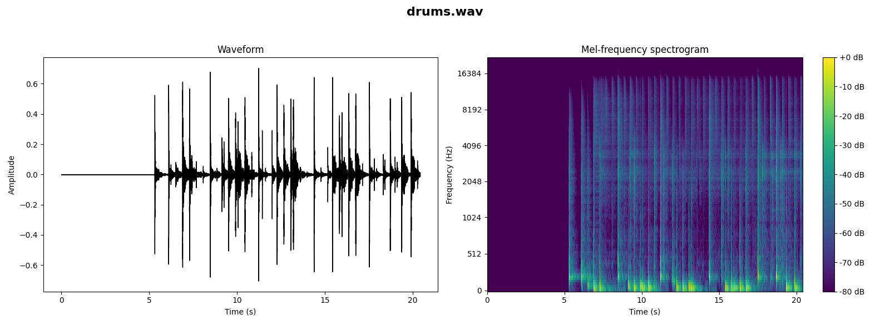
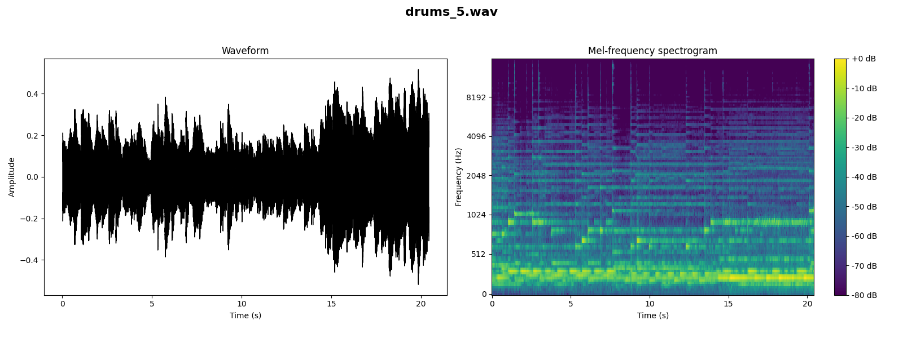
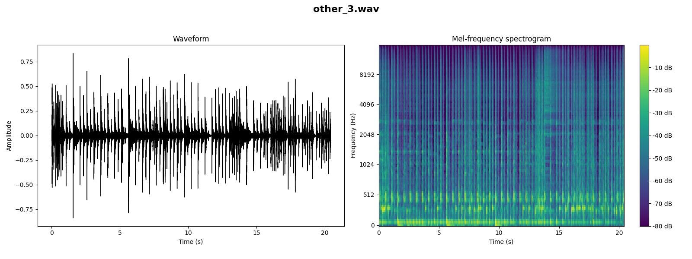

[Go to Prompt1](#prompt1) [Go to Prompt2](#prompt2) [Go to Prompt3](#prompt3)

<h2 id=prompt1>Prompt 1</h2>
A traditional blues track featuring a slow, soulful tempo. The song should be built around a 12-bar blues structure with prominent electric guitar riffs and a harmonica. Background should include a steady bass line and a minimalist drum beat to enhance the melancholic yet resilient spirit of blues.

<audio controls>
  <source src="initial_prompt1.wav" type="audio/wav">
Your browser does not support the audio element.
</audio>

## Stem Content

### Vocals

<audio controls>
  <source src="stem1/vocals.wav" type="audio/wav">
Your browser does not support the audio element.
</audio>

### Bass

<audio controls>
  <source src="stem1/bass.wav" type="audio/wav">
Your browser does not support the audio element.
</audio>

### Drums

<audio controls>
  <source src="stem1/drums.wav" type="audio/wav">
Your browser does not support the audio element.
</audio>

### Other

<audio controls>
  <source src="stem1/other.wav" type="audio/wav">
Your browser does not support the audio element.
</audio>

## Iterations

### Drums Iterations
#### Drums Iteration 1

<audio controls>
  <source src="iterations1/drums_1.wav" type="audio/wav">
Your browser does not support the audio element.
</audio>
#### Drums Iteration 2

<audio controls>
  <source src="iterations1/drums_2.wav" type="audio/wav">
Your browser does not support the audio element.
</audio>
#### Drums Iteration 3

<audio controls>
  <source src="iterations1/drums_3.wav" type="audio/wav">
Your browser does not support the audio element.
</audio>
#### Drums Iteration 4

<audio controls>
  <source src="iterations1/drums_4.wav" type="audio/wav">
Your browser does not support the audio element.
</audio>
#### Drums Iteration 5

<audio controls>
  <source src="iterations1/drums_5.wav" type="audio/wav">
Your browser does not support the audio element.
</audio>
#### Drums Iteration 6

<audio controls>
  <source src="iterations1/drums_6.wav" type="audio/wav">
Your browser does not support the audio element.
</audio>
#### Drums Iteration 7

<audio controls>
  <source src="iterations1/drums_7.wav" type="audio/wav">
Your browser does not support the audio element.
</audio>
#### Drums Iteration 8

<audio controls>
  <source src="iterations1/drums_8.wav" type="audio/wav">
Your browser does not support the audio element.
</audio>
#### Drums Iteration 9

<audio controls>
  <source src="iterations1/drums_9.wav" type="audio/wav">
Your browser does not support the audio element.
</audio>
#### Drums Iteration 10

<audio controls>
  <source src="iterations1/drums_10.wav" type="audio/wav">
Your browser does not support the audio element.
</audio>

### Bass Iterations
#### Bass Iteration 1

<audio controls>
  <source src="iterations1/bass_1.wav" type="audio/wav">
Your browser does not support the audio element.
</audio>
#### Bass Iteration 2

<audio controls>
  <source src="iterations1/bass_2.wav" type="audio/wav">
Your browser does not support the audio element.
</audio>
#### Bass Iteration 3

<audio controls>
  <source src="iterations1/bass_3.wav" type="audio/wav">
Your browser does not support the audio element.
</audio>
#### Bass Iteration 4

<audio controls>
  <source src="iterations1/bass_4.wav" type="audio/wav">
Your browser does not support the audio element.
</audio>
#### Bass Iteration 5

<audio controls>
  <source src="iterations1/bass_5.wav" type="audio/wav">
Your browser does not support the audio element.
</audio>
#### Bass Iteration 6

<audio controls>
  <source src="iterations1/bass_6.wav" type="audio/wav">
Your browser does not support the audio element.
</audio>
#### Bass Iteration 7

<audio controls>
  <source src="iterations1/bass_7.wav" type="audio/wav">
Your browser does not support the audio element.
</audio>
#### Bass Iteration 8

<audio controls>
  <source src="iterations1/bass_8.wav" type="audio/wav">
Your browser does not support the audio element.
</audio>
#### Bass Iteration 9

<audio controls>
  <source src="iterations1/bass_9.wav" type="audio/wav">
Your browser does not support the audio element.
</audio>
#### Bass Iteration 10

<audio controls>
  <source src="iterations1/bass_10.wav" type="audio/wav">
Your browser does not support the audio element.
</audio>

### Other Iterations
#### Other Iteration 1

<audio controls>
  <source src="iterations1/other_1.wav" type="audio/wav">
Your browser does not support the audio element.
</audio>
#### Other Iteration 2

<audio controls>
  <source src="iterations1/other_2.wav" type="audio/wav">
Your browser does not support the audio element.
</audio>
#### Other Iteration 3

<audio controls>
  <source src="iterations1/other_3.wav" type="audio/wav">
Your browser does not support the audio element.
</audio>
#### Other Iteration 4

<audio controls>
  <source src="iterations1/other_4.wav" type="audio/wav">
Your browser does not support the audio element.
</audio>
#### Other Iteration 5

<audio controls>
  <source src="iterations1/other_5.wav" type="audio/wav">
Your browser does not support the audio element.
</audio>
#### Other Iteration 6

<audio controls>
  <source src="iterations1/other_6.wav" type="audio/wav">
Your browser does not support the audio element.
</audio>
#### Other Iteration 7

<audio controls>
  <source src="iterations1/other_7.wav" type="audio/wav">
Your browser does not support the audio element.
</audio>
#### Other Iteration 8

<audio controls>
  <source src="iterations1/other_8.wav" type="audio/wav">
Your browser does not support the audio element.
</audio>
#### Other Iteration 9

<audio controls>
  <source src="iterations1/other_9.wav" type="audio/wav">
Your browser does not support the audio element.
</audio>
#### Other Iteration 10

<audio controls>
  <source src="iterations1/other_10.wav" type="audio/wav">
Your browser does not support the audio element.
</audio>

### Vocals Iterations
#### Vocals Iteration 1

<audio controls>
  <source src="iterations1/vocals_1.wav" type="audio/wav">
Your browser does not support the audio element.
</audio>
#### Vocals Iteration 2

<audio controls>
  <source src="iterations1/vocals_2.wav" type="audio/wav">
Your browser does not support the audio element.
</audio>
#### Vocals Iteration 3

<audio controls>
  <source src="iterations1/vocals_3.wav" type="audio/wav">
Your browser does not support the audio element.
</audio>
#### Vocals Iteration 4

<audio controls>
  <source src="iterations1/vocals_4.wav" type="audio/wav">
Your browser does not support the audio element.
</audio>
#### Vocals Iteration 5

<audio controls>
  <source src="iterations1/vocals_5.wav" type="audio/wav">
Your browser does not support the audio element.
</audio>
#### Vocals Iteration 6

<audio controls>
  <source src="iterations1/vocals_6.wav" type="audio/wav">
Your browser does not support the audio element.
</audio>
#### Vocals Iteration 7

<audio controls>
  <source src="iterations1/vocals_7.wav" type="audio/wav">
Your browser does not support the audio element.
</audio>
#### Vocals Iteration 8

<audio controls>
  <source src="iterations1/vocals_8.wav" type="audio/wav">
Your browser does not support the audio element.
</audio>
#### Vocals Iteration 9

<audio controls>
  <source src="iterations1/vocals_9.wav" type="audio/wav">
Your browser does not support the audio element.
</audio>
#### Vocals Iteration 10

<audio controls>
  <source src="iterations1/vocals_10.wav" type="audio/wav">
Your browser does not support the audio element.
</audio>

<h2 id=prompt2>Prompt 2</h2>
A classical music piece that embodies the elegance and complexity of the Baroque period. The composition should involve a full orchestra with a focus on string instruments like violins, violas, and cellos, complemented by harpsichords and woodwinds. Add intricate melodies and counterpoint techniques that highlight the skills of individual musicians.

<audio controls>
  <source src="initial_prompt2.wav" type="audio/wav">
Your browser does not support the audio element.
</audio>

## Stem Content

### Vocals

<audio controls>
  <source src="stem2/vocals.wav" type="audio/wav">
Your browser does not support the audio element.
</audio>

### Bass

<audio controls>
  <source src="stem2/bass.wav" type="audio/wav">
Your browser does not support the audio element.
</audio>

### Drums

<audio controls>
  <source src="stem2/drums.wav" type="audio/wav">
Your browser does not support the audio element.
</audio>

### Other

<audio controls>
  <source src="stem2/other.wav" type="audio/wav">
Your browser does not support the audio element.
</audio>

## Iterations

### Drums Iterations
#### Drums Iteration 1

<audio controls>
  <source src="iterations2/drums_1.wav" type="audio/wav">
Your browser does not support the audio element.
</audio>
#### Drums Iteration 2

<audio controls>
  <source src="iterations2/drums_2.wav" type="audio/wav">
Your browser does not support the audio element.
</audio>
#### Drums Iteration 3

<audio controls>
  <source src="iterations2/drums_3.wav" type="audio/wav">
Your browser does not support the audio element.
</audio>
#### Drums Iteration 4

<audio controls>
  <source src="iterations2/drums_4.wav" type="audio/wav">
Your browser does not support the audio element.
</audio>
#### Drums Iteration 5

<audio controls>
  <source src="iterations2/drums_5.wav" type="audio/wav">
Your browser does not support the audio element.
</audio>
#### Drums Iteration 6

<audio controls>
  <source src="iterations2/drums_6.wav" type="audio/wav">
Your browser does not support the audio element.
</audio>
#### Drums Iteration 7

<audio controls>
  <source src="iterations2/drums_7.wav" type="audio/wav">
Your browser does not support the audio element.
</audio>
#### Drums Iteration 8

<audio controls>
  <source src="iterations2/drums_8.wav" type="audio/wav">
Your browser does not support the audio element.
</audio>
#### Drums Iteration 9

<audio controls>
  <source src="iterations2/drums_9.wav" type="audio/wav">
Your browser does not support the audio element.
</audio>
#### Drums Iteration 10

<audio controls>
  <source src="iterations2/drums_10.wav" type="audio/wav">
Your browser does not support the audio element.
</audio>

### Bass Iterations
#### Bass Iteration 1

<audio controls>
  <source src="iterations2/bass_1.wav" type="audio/wav">
Your browser does not support the audio element.
</audio>
#### Bass Iteration 2

<audio controls>
  <source src="iterations2/bass_2.wav" type="audio/wav">
Your browser does not support the audio element.
</audio>
#### Bass Iteration 3

<audio controls>
  <source src="iterations2/bass_3.wav" type="audio/wav">
Your browser does not support the audio element.
</audio>
#### Bass Iteration 4

<audio controls>
  <source src="iterations2/bass_4.wav" type="audio/wav">
Your browser does not support the audio element.
</audio>
#### Bass Iteration 5

<audio controls>
  <source src="iterations2/bass_5.wav" type="audio/wav">
Your browser does not support the audio element.
</audio>
#### Bass Iteration 6

<audio controls>
  <source src="iterations2/bass_6.wav" type="audio/wav">
Your browser does not support the audio element.
</audio>
#### Bass Iteration 7

<audio controls>
  <source src="iterations2/bass_7.wav" type="audio/wav">
Your browser does not support the audio element.
</audio>
#### Bass Iteration 8

<audio controls>
  <source src="iterations2/bass_8.wav" type="audio/wav">
Your browser does not support the audio element.
</audio>
#### Bass Iteration 9

<audio controls>
  <source src="iterations2/bass_9.wav" type="audio/wav">
Your browser does not support the audio element.
</audio>
#### Bass Iteration 10

<audio controls>
  <source src="iterations2/bass_10.wav" type="audio/wav">
Your browser does not support the audio element.
</audio>

### Other Iterations
#### Other Iteration 1

<audio controls>
  <source src="iterations2/other_1.wav" type="audio/wav">
Your browser does not support the audio element.
</audio>
#### Other Iteration 2

<audio controls>
  <source src="iterations2/other_2.wav" type="audio/wav">
Your browser does not support the audio element.
</audio>
#### Other Iteration 3

<audio controls>
  <source src="iterations2/other_3.wav" type="audio/wav">
Your browser does not support the audio element.
</audio>
#### Other Iteration 4

<audio controls>
  <source src="iterations2/other_4.wav" type="audio/wav">
Your browser does not support the audio element.
</audio>
#### Other Iteration 5

<audio controls>
  <source src="iterations2/other_5.wav" type="audio/wav">
Your browser does not support the audio element.
</audio>
#### Other Iteration 6

<audio controls>
  <source src="iterations2/other_6.wav" type="audio/wav">
Your browser does not support the audio element.
</audio>
#### Other Iteration 7

<audio controls>
  <source src="iterations2/other_7.wav" type="audio/wav">
Your browser does not support the audio element.
</audio>
#### Other Iteration 8

<audio controls>
  <source src="iterations2/other_8.wav" type="audio/wav">
Your browser does not support the audio element.
</audio>
#### Other Iteration 9

<audio controls>
  <source src="iterations2/other_9.wav" type="audio/wav">
Your browser does not support the audio element.
</audio>
#### Other Iteration 10

<audio controls>
  <source src="iterations2/other_10.wav" type="audio/wav">
Your browser does not support the audio element.
</audio>

### Vocals Iterations
#### Vocals Iteration 1

<audio controls>
  <source src="iterations2/vocals_1.wav" type="audio/wav">
Your browser does not support the audio element.
</audio>
#### Vocals Iteration 2

<audio controls>
  <source src="iterations2/vocals_2.wav" type="audio/wav">
Your browser does not support the audio element.
</audio>
#### Vocals Iteration 3

<audio controls>
  <source src="iterations2/vocals_3.wav" type="audio/wav">
Your browser does not support the audio element.
</audio>
#### Vocals Iteration 4

<audio controls>
  <source src="iterations2/vocals_4.wav" type="audio/wav">
Your browser does not support the audio element.
</audio>
#### Vocals Iteration 5

<audio controls>
  <source src="iterations2/vocals_5.wav" type="audio/wav">
Your browser does not support the audio element.
</audio>
#### Vocals Iteration 6

<audio controls>
  <source src="iterations2/vocals_6.wav" type="audio/wav">
Your browser does not support the audio element.
</audio>
#### Vocals Iteration 7

<audio controls>
  <source src="iterations2/vocals_7.wav" type="audio/wav">
Your browser does not support the audio element.
</audio>
#### Vocals Iteration 8

<audio controls>
  <source src="iterations2/vocals_8.wav" type="audio/wav">
Your browser does not support the audio element.
</audio>
#### Vocals Iteration 9

<audio controls>
  <source src="iterations2/vocals_9.wav" type="audio/wav">
Your browser does not support the audio element.
</audio>
#### Vocals Iteration 10

<audio controls>
  <source src="iterations2/vocals_10.wav" type="audio/wav">
Your browser does not support the audio element.
</audio>

<h2 id=prompt3>Prompt 3</h2>
A reggae track with a relaxed and upbeat rhythm characteristic of traditional reggae music. Use steady drum patterns, a bass guitar playing on the offbeat, and rhythmic guitar strumming. Include elements like the melodica or steel drums to give it an authentic island sound.

<audio controls>
  <source src="initial_prompt3.wav" type="audio/wav">
Your browser does not support the audio element.
</audio>

## Stem Content

### Vocals

<audio controls>
  <source src="stem3/vocals.wav" type="audio/wav">
Your browser does not support the audio element.
</audio>

### Bass

<audio controls>
  <source src="stem3/bass.wav" type="audio/wav">
Your browser does not support the audio element.
</audio>

### Drums

<audio controls>
  <source src="stem3/drums.wav" type="audio/wav">
Your browser does not support the audio element.
</audio>

### Other

<audio controls>
  <source src="stem3/other.wav" type="audio/wav">
Your browser does not support the audio element.
</audio>

## Iterations

### Drums Iterations
#### Drums Iteration 1

<audio controls>
  <source src="iterations3/drums_1.wav" type="audio/wav">
Your browser does not support the audio element.
</audio>
#### Drums Iteration 2

<audio controls>
  <source src="iterations3/drums_2.wav" type="audio/wav">
Your browser does not support the audio element.
</audio>
#### Drums Iteration 3

<audio controls>
  <source src="iterations3/drums_3.wav" type="audio/wav">
Your browser does not support the audio element.
</audio>
#### Drums Iteration 4

<audio controls>
  <source src="iterations3/drums_4.wav" type="audio/wav">
Your browser does not support the audio element.
</audio>
#### Drums Iteration 5

<audio controls>
  <source src="iterations3/drums_5.wav" type="audio/wav">
Your browser does not support the audio element.
</audio>
#### Drums Iteration 6

<audio controls>
  <source src="iterations3/drums_6.wav" type="audio/wav">
Your browser does not support the audio element.
</audio>
#### Drums Iteration 7

<audio controls>
  <source src="iterations3/drums_7.wav" type="audio/wav">
Your browser does not support the audio element.
</audio>
#### Drums Iteration 8

<audio controls>
  <source src="iterations3/drums_8.wav" type="audio/wav">
Your browser does not support the audio element.
</audio>
#### Drums Iteration 9

<audio controls>
  <source src="iterations3/drums_9.wav" type="audio/wav">
Your browser does not support the audio element.
</audio>
#### Drums Iteration 10

<audio controls>
  <source src="iterations3/drums_10.wav" type="audio/wav">
Your browser does not support the audio element.
</audio>

### Bass Iterations
#### Bass Iteration 1

<audio controls>
  <source src="iterations3/bass_1.wav" type="audio/wav">
Your browser does not support the audio element.
</audio>
#### Bass Iteration 2

<audio controls>
  <source src="iterations3/bass_2.wav" type="audio/wav">
Your browser does not support the audio element.
</audio>
#### Bass Iteration 3

<audio controls>
  <source src="iterations3/bass_3.wav" type="audio/wav">
Your browser does not support the audio element.
</audio>
#### Bass Iteration 4

<audio controls>
  <source src="iterations3/bass_4.wav" type="audio/wav">
Your browser does not support the audio element.
</audio>
#### Bass Iteration 5

<audio controls>
  <source src="iterations3/bass_5.wav" type="audio/wav">
Your browser does not support the audio element.
</audio>
#### Bass Iteration 6

<audio controls>
  <source src="iterations3/bass_6.wav" type="audio/wav">
Your browser does not support the audio element.
</audio>
#### Bass Iteration 7

<audio controls>
  <source src="iterations3/bass_7.wav" type="audio/wav">
Your browser does not support the audio element.
</audio>
#### Bass Iteration 8

<audio controls>
  <source src="iterations3/bass_8.wav" type="audio/wav">
Your browser does not support the audio element.
</audio>
#### Bass Iteration 9

<audio controls>
  <source src="iterations3/bass_9.wav" type="audio/wav">
Your browser does not support the audio element.
</audio>
#### Bass Iteration 10

<audio controls>
  <source src="iterations3/bass_10.wav" type="audio/wav">
Your browser does not support the audio element.
</audio>

### Other Iterations
#### Other Iteration 1

<audio controls>
  <source src="iterations3/other_1.wav" type="audio/wav">
Your browser does not support the audio element.
</audio>
#### Other Iteration 2

<audio controls>
  <source src="iterations3/other_2.wav" type="audio/wav">
Your browser does not support the audio element.
</audio>
#### Other Iteration 3

<audio controls>
  <source src="iterations3/other_3.wav" type="audio/wav">
Your browser does not support the audio element.
</audio>
#### Other Iteration 4

<audio controls>
  <source src="iterations3/other_4.wav" type="audio/wav">
Your browser does not support the audio element.
</audio>
#### Other Iteration 5

<audio controls>
  <source src="iterations3/other_5.wav" type="audio/wav">
Your browser does not support the audio element.
</audio>
#### Other Iteration 6

<audio controls>
  <source src="iterations3/other_6.wav" type="audio/wav">
Your browser does not support the audio element.
</audio>
#### Other Iteration 7

<audio controls>
  <source src="iterations3/other_7.wav" type="audio/wav">
Your browser does not support the audio element.
</audio>
#### Other Iteration 8

<audio controls>
  <source src="iterations3/other_8.wav" type="audio/wav">
Your browser does not support the audio element.
</audio>
#### Other Iteration 9

<audio controls>
  <source src="iterations3/other_9.wav" type="audio/wav">
Your browser does not support the audio element.
</audio>
#### Other Iteration 10

<audio controls>
  <source src="iterations3/other_10.wav" type="audio/wav">
Your browser does not support the audio element.
</audio>

### Vocals Iterations
#### Vocals Iteration 1

<audio controls>
  <source src="iterations3/vocals_1.wav" type="audio/wav">
Your browser does not support the audio element.
</audio>
#### Vocals Iteration 2

<audio controls>
  <source src="iterations3/vocals_2.wav" type="audio/wav">
Your browser does not support the audio element.
</audio>
#### Vocals Iteration 3

<audio controls>
  <source src="iterations3/vocals_3.wav" type="audio/wav">
Your browser does not support the audio element.
</audio>
#### Vocals Iteration 4

<audio controls>
  <source src="iterations3/vocals_4.wav" type="audio/wav">
Your browser does not support the audio element.
</audio>
#### Vocals Iteration 5

<audio controls>
  <source src="iterations3/vocals_5.wav" type="audio/wav">
Your browser does not support the audio element.
</audio>
#### Vocals Iteration 6

<audio controls>
  <source src="iterations3/vocals_6.wav" type="audio/wav">
Your browser does not support the audio element.
</audio>
#### Vocals Iteration 7

<audio controls>
  <source src="iterations3/vocals_7.wav" type="audio/wav">
Your browser does not support the audio element.
</audio>
#### Vocals Iteration 8

<audio controls>
  <source src="iterations3/vocals_8.wav" type="audio/wav">
Your browser does not support the audio element.
</audio>
#### Vocals Iteration 9

<audio controls>
  <source src="iterations3/vocals_9.wav" type="audio/wav">
Your browser does not support the audio element.
</audio>
#### Vocals Iteration 10

<audio controls>
  <source src="iterations3/vocals_10.wav" type="audio/wav">
Your browser does not support the audio element.
</audio>

