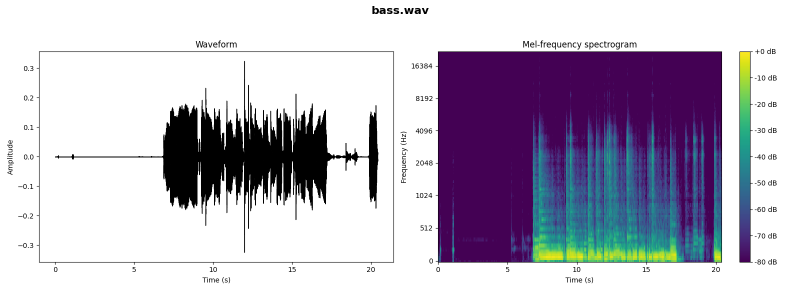
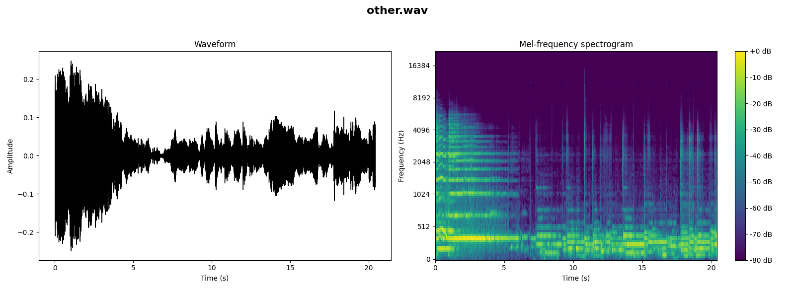
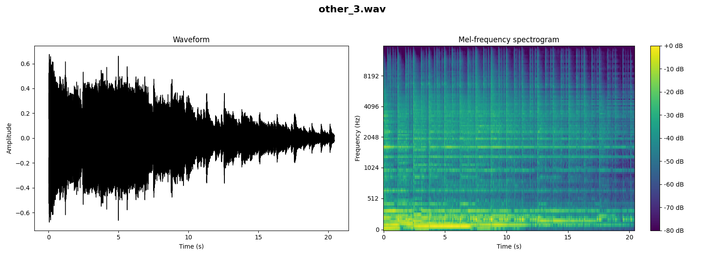

[Go to Prompt1](#prompt1) [Go to Prompt2](#prompt2) [Go to Prompt3](#prompt3)

<h2 id=prompt1>Prompt 1</h2>  
[Go to Prompt selection](#prompt)  
  
A traditional blues track featuring a slow, soulful tempo. The song should be built around a 12-bar blues structure with prominent electric guitar riffs and a harmonica. Background should include a steady bass line and a minimalist drum beat to enhance the melancholic yet resilient spirit of blues.

<audio controls>
  <source src="initial_prompt1.wav" type="audio/wav">
Your browser does not support the audio element.
</audio>

## Stem Content

### Prompt 1 - Drums stem
[Go to Prompt 1](#prompt1)  

instrumental. medium with a hip-hop beat with steady drumming, cymbals crashing, tambourine percussions, and a male voice chanting the same phrase. The audio quality is poor.
an electro song that consists of a low pitched male vocal talking, after which there is a punchy kick and snare hits, shimmering cymbals and groovy bass guitar. energetic and addictive.   

<audio controls>
  <source src="stem1/drums.wav" type="audio/wav">
Your browser does not support the audio element.
</audio>

### Prompt 1 - Bass stem
[Go to Prompt 1](#prompt1)  

An electric guitar melody played over playback instrumental. The recording is noisy and in mono.
An electric guitar melody playing. The recording is noisy and in mono.

<audio controls>
  <source src="stem1/bass.wav" type="audio/wav">
Your browser does not support the audio element.
</audio>

### Prompt 1 - Other stem
[Go to Prompt 1](#prompt1)  

a passionate electric guitar melody playing in the background. emotional and passionate. The recording is noisy and in mono.
an electric guitar melody. mellow, chill and easygoing.
   

<audio controls>
  <source src="stem1/other.wav" type="audio/wav">
Your browser does not support the audio element.
</audio>

### Prompt 1 - Vocals stem
[Go to Prompt 1](#prompt1)  

a woodblock one shot. The recording is noisy and in mono.
a woodblock one shot. The recording is noisy and in mono.
   

<audio controls>
  <source src="stem1/vocals.wav" type="audio/wav">
Your browser does not support the audio element.
</audio>

## Iterations

### Drums Iterations
#### Prompt 1 - Drums Iteration 1
[Go to Prompt 1](#prompt1)  

a hip hop song that consists of a low pitched female vocal talking over punchy kick and snare hits, low toms, shimmering hi hats, groovy bass and synth keys melody. chill and easygoing.
This song contains someone scratching over a hip hop beat with a lot of scratching. This is an amateur recording.
 

<audio controls>
  <source src="iterations1/drums_1.wav" type="audio/wav">
Your browser does not support the audio element.
</audio>

#### Prompt 1 - Drums Iteration 2
[Go to Prompt 1](#prompt1) 

The song is an instrumental. medium with a groovy bass line, steady drumming rhythm, keyboard accompaniment and various percussion hits. The song is youthful and groovy. The audio quality is average.
   

<audio controls>
  <source src="iterations1/drums_2.wav" type="audio/wav">
Your browser does not support the audio element.
</audio>

#### Prompt 1 - Drums Iteration 3
[Go to Prompt 1](#prompt1) 

an electro song that consists of a punchy kick, buzzy synth bass, claps and shimmering hi-hats. exciting and a bit too digital.
an electro song that consists of a punchy kick, buzzy synth bass, claps and shimmering hi-hats. groovy and the recording is noisy.
   
   

<audio controls>
  <source src="iterations1/drums_3.wav" type="audio/wav">
Your browser does not support the audio element.
</audio>

#### Prompt 1 - Drums Iteration 4
[Go to Prompt 1](#prompt1) 

a drum cover of a pop song that consists of energetic tom rolls, shimmering cymbals and punchy kick and snare hits. energetic and exciting.
a drum cover of a pop song that consists of energetic tom rolls, shimmering cymbals and punchy kick and snare hits. energetic and exciting.
  
   

<audio controls>
  <source src="iterations1/drums_4.wav" type="audio/wav">
Your browser does not support the audio element.
</audio>

#### Prompt 1 - Drums Iteration 5
[Go to Prompt 1](#prompt1) 

This is an industrial metal/alternative metal music piece. There is a male vocalist singing melodically in the lead. The main tune is being played by the keyboard and the electric guitar while the bass guitar are playing in the background. The rhythm is provided by a fast tempo acoustic drum beat. The atmosphere is aggressive. This piece could be played at nightclubs or dance clubs.
This clip features a drum solo. The kick is played on the cowbell. The snare is played continuously on the first count of the song. After four bars, the percussion plays a simple beat. The bass plays a groovy bassline. There are no voices in this song. This song can be played in a video game.
    
   

<audio controls>
  <source src="iterations1/drums_5.wav" type="audio/wav">
Your browser does not support the audio element.
</audio>

#### Prompt 1 - Drums Iteration 6
[Go to Prompt 1](#prompt1) 

This clip features a drum solo being played on a rock drum kit. The snare, kick, toms, hi-hat and splash are being struck. A pattern is played on this percussion. There are no other instruments in this song. There is no voice in this clip. This song can be played in a drum instruction video.
a cover of a rock song and it consists of a flat male vocal talking, followed by punchy kick and snare hits. energetic and the recording is noisy and in mono.
   

<audio controls>
  <source src="iterations1/drums_6.wav" type="audio/wav">
Your browser does not support the audio element.
</audio>

#### Prompt 1 - Drums Iteration 7
[Go to Prompt 1](#prompt1) 

someone playing a drum set with a fill-ins on the backbeat. A e-guitar is playing a countermelody in a higher register along with a drum stick hit. This song may be playing live at a festival.
 
   

<audio controls>
  <source src="iterations1/drums_7.wav" type="audio/wav">
Your browser does not support the audio element.
</audio>

#### Prompt 1 - Drums Iteration 8
[Go to Prompt 1](#prompt1) 

an electric guitar melody played over playback that consists of groovy bass, shimmering hi hats and snare hits. There are some crowd noises in the background. The recording is noisy and in mono.
an arpeggiated electric guitar melody. The recording is noisy and in mono.

   

<audio controls>
  <source src="iterations1/drums_8.wav" type="audio/wav">
Your browser does not support the audio element.
</audio>

#### Prompt 1 - Drums Iteration 9
[Go to Prompt 1](#prompt1) 

someone playing a melody on a theremin. This is an amateur recording. This song may be playing in a church.
someone playing a very fast snare drum-roll. This is an amateur recording. You can hear clicking and recording noises. This audio may be playing in a theater.
   

<audio controls>
  <source src="iterations1/drums_9.wav" type="audio/wav">
Your browser does not support the audio element.
</audio>

#### Prompt 1 - Drums Iteration 10
[Go to Prompt 1](#prompt1) 

a cover of a rock song and it consists of a flat male vocal singing over acoustic rhythm guitar chords. The recording is noisy and in mono.
a cover of a rock song and it consists of a flat male vocal singing over acoustic rhythm guitar chords. The recording is noisy, in mono and passionate and emotional. 
   

<audio controls>
  <source src="iterations1/drums_10.wav" type="audio/wav">
Your browser does not support the audio element.
</audio>

### Bass Iterations
#### Prompt 1 - Bass Iteration 1
[Go to Prompt 1](#prompt1) 

instrumental. fast with an enthusiastic electric guitar riff. muffled, punchy, buoyant and vibrant. The audio quality is poor with ambient sounds of people clapping and cheering.
instrumental. medium with a ukelelele rhythm. droning, rhythmic, deep and has a tribal feel. The audio quality is poor.

   

<audio controls>
  <source src="iterations1/bass_1.wav" type="audio/wav">
Your browser does not support the audio element.
</audio>

#### Prompt 1 - Bass Iteration 2
[Go to Prompt 1](#prompt1) 

an instrumental. medium with a lively accordion harmony, tuba and other stringed instruments. playful, cheerful, happy, joyful and animated.
someone playing a melody on a synthesizer in the mid- to higher register. A tambourine is playing a short melody on top in a higher key. This song may be playing in a meditation session.
   

<audio controls>
  <source src="iterations1/bass_2.wav" type="audio/wav">
Your browser does not support the audio element.
</audio>

#### Prompt 1 - Bass Iteration 3
[Go to Prompt 1](#prompt1) 

a live performance of a folk song and it consists of harmonica solo melody over groovy double bass and arpeggiated acoustic guitar melody. passionate and emotional.
a cover of a blues song and it consists of harmonica solo melody played over groovy double bass and shimmering hi-hats. The recording is noisy and in mono.
 
   

<audio controls>
  <source src="iterations1/bass_3.wav" type="audio/wav">
Your browser does not support the audio element.
</audio>

#### Prompt 1 - Bass Iteration 4
[Go to Prompt 1](#prompt1) 

instrumental. slow with a harmonica playing the main melody. soft, mellow, euphonious, dreamy, sentimental and romantic. Classical Instrumental.
a harmonica solo melody playing. The recording is noisy, in mono and emotional and passionate.

   

<audio controls>
  <source src="iterations1/bass_4.wav" type="audio/wav">
Your browser does not support the audio element.
</audio>

#### Prompt 1 - Bass Iteration 5
[Go to Prompt 1](#prompt1) 

wedding march that belongs to Scottish folk music. It is an instrumental piece. The tune is being played by the French bagpipes at a medium-to-high pitch. The atmosphere is cheerful. This piece could be playing at a Scottish wedding. It could also be included in the soundtrack of a historical drama movie during wedding scenes.
gospel music piece. There is a female vocalist singing melodically in the lead. The tune is being played by a clarinet while the bass guitar plays in the background. The atmosphere is religious. This piece could be used in the soundtrack of a historical drama movie during the scenes where the characters are reminiscing about the good old days.
 
   

<audio controls>
  <source src="iterations1/bass_5.wav" type="audio/wav">
Your browser does not support the audio element.
</audio>

#### Prompt 1 - Bass Iteration 6
[Go to Prompt 1](#prompt1) 

The song is an instrumental. The song is medium tempo with a accordion playing in harmony and accompaniment style with both medley and harmony and no other instrumentation. beautiful and romantic. The audio quality is poor.
instrumental. slow with a violin harmony, piano accompaniment and rhythmic whistling sounds. soft, mellow, passionate, emotional and sentimental. a Western Classical.

   

<audio controls>
  <source src="iterations1/bass_6.wav" type="audio/wav">
Your browser does not support the audio element.
</audio>

#### Prompt 1 - Bass Iteration 7
[Go to Prompt 1](#prompt1) 

a sustained string melody, followed by woodwind and mellow piano melody. emotional and passionate - like something you would hear in old cartoons.
an arpeggiated harp melody. mellow, soft, emotional and sad.
 
   

<audio controls>
  <source src="iterations1/bass_7.wav" type="audio/wav">
Your browser does not support the audio element.
</audio>

#### Prompt 1 - Bass Iteration 8
[Go to Prompt 1](#prompt1) 

a mellow arpeggiated piano melody playing in the background, while the breathy flute melody is playing over it. sad, emotional and passionate.
a sustained string melody, followed by woodwind and mellow marimba melodies. emotional, passionate and sad - like something you would hear in movies.
 
   

<audio controls>
  <source src="iterations1/bass_8.wav" type="audio/wav">
Your browser does not support the audio element.
</audio>

#### Prompt 1 - Bass Iteration 9
[Go to Prompt 1](#prompt1) 

a mellow piano melody, followed by sustained cello melody. sad, emotional and passionate.
a mellow piano melody, followed by sustained strings melody. sad, emotional and melancholic.

   

<audio controls>
  <source src="iterations1/bass_9.wav" type="audio/wav">
Your browser does not support the audio element.
</audio>

#### Prompt 1 - Bass Iteration 10
[Go to Prompt 1](#prompt1) 

a live performance of an orchestra and it consists of sustained strings melody, mellow woodwinds melody, suspenseful violin melody and muffled percussion. epic, powerful and passionate.
a wide brass melody, woodwinds melody and mellow piano melody. suspenseful and intense.
   

<audio controls>
  <source src="iterations1/bass_10.wav" type="audio/wav">
Your browser does not support the audio element.
</audio>

### Other Iterations
#### Prompt 1 - Other Iteration 1
[Go to Prompt 1](#prompt1) 

an electric guitar solo melody. passionate and emotional. The recording is noisy and in mono.
an electric guitar melody played over playback that consists of punchy kick and snare hits, shimmering hi hats and groovy bass. emotional and the recording is noisy and in mono.

   

<audio controls>
  <source src="iterations1/other_1.wav" type="audio/wav">
Your browser does not support the audio element.
</audio>

#### Prompt 1 - Other Iteration 2
[Go to Prompt 1](#prompt1) 

The song is an instrumental. medium with a guitar playing rhythm, steady drumming rhythm, cymbal crashes and guitar strumming rhythm. The song is emotional and passionate. The audio quality is poor.
The song is an instrumental. slow with a guitarist demonstrating a guitar playing arpeggiated melody. The song is emotional and has poor audio quality.

   

<audio controls>
  <source src="iterations1/other_2.wav" type="audio/wav">
Your browser does not support the audio element.
</audio>

#### Prompt 1 - Other Iteration 3
[Go to Prompt 1](#prompt1) 

a cover of a rock song that consists of a passionate female vocal singing over sustained strings melody, punchy kick and snare hits, shimmering hi hats and acoustic rhythm guitar. emotional and passionate.
a cover of a rock song and it consists of an arpeggiated electric guitar melody playing over it. The recording is noisy and in mono.

   

<audio controls>
  <source src="iterations1/other_3.wav" type="audio/wav">
Your browser does not support the audio element.
</audio>

#### Prompt 1 - Other Iteration 4
[Go to Prompt 1](#prompt1) 

a live performance of a rock song that consists of an electric guitar melody played over groovy bass guitar, punchy snare and shimmering cymbals. easygoing and energetic.
This is an alternative rock music piece. There is a male vocalist singing melodically. The main tune is being played by the acoustic guitar while the bass guitar is playing in the background. The rhythmic background consists of a slow tempo acoustic drum beat. The atmosphere is melancholic. This piece could be used in the soundtrack of a drama movie that takes place in the United Kingdom.
   
   

<audio controls>
  <source src="iterations1/other_4.wav" type="audio/wav">
Your browser does not support the audio element.
</audio>

#### Prompt 1 - Other Iteration 5
[Go to Prompt 1](#prompt1) 

This amateur recording features a guitar solo being played. Only one note is played on the instrument. This is accompanied by percussion playing a simple beat. The bass plays the root notes of the chords. There are no voices in this song. This song can be played in an instructional video.
a harpsichord melody being played. There are some ambient sounds in the background. The recording is noisy and in mono.
    
   

<audio controls>
  <source src="iterations1/other_5.wav" type="audio/wav">
Your browser does not support the audio element.
</audio>

#### Prompt 1 - Other Iteration 6
[Go to Prompt 1](#prompt1) 

a harpsichord melody being played. There are some keyboard tapping sounds in the right channel of the stereo image. The recording is a bit noisy.
a harpsichord melody being played. The recording is noisy and passionate and emotional.
  
   

<audio controls>
  <source src="iterations1/other_6.wav" type="audio/wav">
Your browser does not support the audio element.
</audio>

#### Prompt 1 - Other Iteration 7
[Go to Prompt 1](#prompt1) 

a cover of a song and it consists of harmonica solo melody over acoustic rhythm guitar chords. passionate and emotional. The recording is noisy and in mono.
a cover of a rock song and it consists of harmonica solo melody over acoustic rhythm guitar chords. passionate and emotional. The recording is noisy and in mono.
   

<audio controls>
  <source src="iterations1/other_7.wav" type="audio/wav">
Your browser does not support the audio element.
</audio>

#### Prompt 1 - Other Iteration 8
[Go to Prompt 1](#prompt1) 

Someone is strumming chords on an e-guitar while someone is playing a melody on a mandolin. This song may be playing gathered around a bonfire.
Someone is strumming chords on an e-guitar while someone is playing a melody on a mandolin. This song may be playing live at a concert.
  
   

<audio controls>
  <source src="iterations1/other_8.wav" type="audio/wav">
Your browser does not support the audio element.
</audio>

#### Prompt 1 - Other Iteration 9
[Go to Prompt 1](#prompt1) 

an accordion melody playing over it. The recording is noisy and emotional and passionate.
instrumental. fast with a beautiful Harpsichord melody. upbeat, catchy, engaging, vibrant and vivacious.
   

<audio controls>
  <source src="iterations1/other_9.wav" type="audio/wav">
Your browser does not support the audio element.
</audio>

#### Prompt 1 - Other Iteration 10
[Go to Prompt 1](#prompt1) 

instrumental. fast with a spirited harmonica harmony. upbeat, catchy, engaging, vibrant and vivacious. a Harmonica instrumental.
a flat male vocal talking, after which there is a synth melody playing. happy and fun. The recording is noisy and in mono.
   

<audio controls>
  <source src="iterations1/other_10.wav" type="audio/wav">
Your browser does not support the audio element.
</audio>

### Vocals Iterations
#### Prompt 1 - Vocals Iteration 1
[Go to Prompt 1](#prompt1) 

This is an instrument showcase jam. There is a flute playing a solo in an instructive manner. The atmosphere is easygoing. This piece could be sampled for use in beat-making.
fast tapping in rhythm. The sounds are clicking. There is a metronome sound present as well. The rhythm is regimented.
   

<audio controls>
  <source src="iterations1/vocals_1.wav" type="audio/wav">
Your browser does not support the audio element.
</audio>

#### Prompt 1 - Vocals Iteration 2
[Go to Prompt 1](#prompt1)

a lively instrumental. medium with a plethora of instruments like trumpets, trombone, tuba, bongos and a mandolin. vibrant, melodic, engaging, happy, cheerful and animated.
someone playing a melody on a harp. This is an amateur recording. This song may be playing in a live concert.

   

<audio controls>
  <source src="iterations1/vocals_2.wav" type="audio/wav">
Your browser does not support the audio element.
</audio>

#### Prompt 1 - Vocals Iteration 3
[Go to Prompt 1](#prompt1) 

someone playing a very low sounding bass flute like instrument. In the background you can hear birds chirping. This song may be playing during a live performance from a music school.
someone playing a very low sounding bass flute like instrument. Playing a rhythmic melody with a percussive sound created with the mouth. This song may be playing in a live concert. 
   

<audio controls>
  <source src="iterations1/vocals_3.wav" type="audio/wav">
Your browser does not support the audio element.
</audio>

#### Prompt 1 - Vocals Iteration 4
[Go to Prompt 1](#prompt1) 

someone playing a xylophone sound and rattles. This is an amateur recording. You can hear clicking and recording noises. This audio may be playing demonstrating specific sounds on a device.
someone playing a xylophone sound and rattles. This is an amateur recording. You can hear clicking and recording noises. This audio may be playing demonstrating specific sounds on a device
   

<audio controls>
  <source src="iterations1/vocals_4.wav" type="audio/wav">
Your browser does not support the audio element.
</audio>

#### Prompt 1 - Vocals Iteration 5
[Go to Prompt 1](#prompt1) 

instrumental. slow with a didgeridoo harmony with the sound of birds chirping. incessant, trippy, hypnotic, meditative and trance like. a drumming tutorial.
someone playing congas with a percussive sound. This is an amateur recording. This may be playing in a live concert.
   

<audio controls>
  <source src="iterations1/vocals_5.wav" type="audio/wav">
Your browser does not support the audio element.
</audio>

#### Prompt 1 - Vocals Iteration 6
[Go to Prompt 1](#prompt1) 

someone playing a xylophone sound and rattles. This is an amateur recording. You can hear clicking and recording noises. This audio may be playing demonstrating specific sounds on a device.
Low fidelity recording of a live concert. The crowd noise is very loud and the audience is screaming. The audio is distorting. Amidst the crowd noise, beat boxing can be heard performing a house music style beat. 
   

<audio controls>
  <source src="iterations1/vocals_6.wav" type="audio/wav">
Your browser does not support the audio element.
</audio>

#### Prompt 1 - Vocals Iteration 7
[Go to Prompt 1](#prompt1) 

a live performance of a traditional song and it consists of a punchy snare hits, shimmering cymbals and wooden percussion. soulful and the recording is noisy.
The song is an instrumental. fast with a bagpipes playing a rhythmic melody. The song is spirited and highly engaging. The audio quality is average and poor.
   

<audio controls>
  <source src="iterations1/vocals_7.wav" type="audio/wav">
Your browser does not support the audio element.
</audio>

#### Prompt 1 - Vocals Iteration 8
[Go to Prompt 1](#prompt1) 

wedding march that belongs to Scottish folk music. It is an instrumental piece. The tune is being played by the French bagpipes at a medium-to-high pitch. The atmosphere is cheerful. This piece could be playing at a Scottish wedding. It could also be included in the soundtrack of a historical drama movie during wedding scenes.
wedding march that belongs to Scottish folk music. It is an instrumental piece. The tune is being played by the French bagpipes at a medium-to-high pitch. The atmosphere is cheerful. This piece could be playing at a Scottish wedding. It could also be included in the soundtrack of a historical drama movie during wedding scenes.
   

<audio controls>
  <source src="iterations1/vocals_8.wav" type="audio/wav">
Your browser does not support the audio element.
</audio>

#### Prompt 1 - Vocals Iteration 9
[Go to Prompt 1](#prompt1) 

a live performance of a folk song and it consists of harmonica solo melody over wooden percussion. emotional and passionate, even though the recording is noisy.
instrumental. fast with a spirited accordion harmony and rhythmic acoustic guitar accompaniment. rich, dense, complex, engaging, full bodied and pleasant. a Folk song instrumental.
   

<audio controls>
  <source src="iterations1/vocals_9.wav" type="audio/wav">
Your browser does not support the audio element.
</audio>

#### Prompt 1 - Vocals Iteration 10
[Go to Prompt 1](#prompt1) 

Someone is playing a melody on a zitar along with a shrutibox in the background. At the end male and female voices are chanting in the mid to high range and a percussive sound can be heard. This song may be playing live at a concert.
This clip features a sound of percussion being played on the snare drum. There are no other instruments in this clip. There is no voice in this song. This song can be played in an instructional video.
   

<audio controls>
  <source src="iterations1/vocals_10.wav" type="audio/wav">
Your browser does not support the audio element.
</audio>

<h2 id=prompt2>Prompt 2</h2>  
[Go to Prompt selection](#prompt)  
   
A classical music piece that embodies the elegance and complexity of the Baroque period. The composition should involve a full orchestra with a focus on string instruments like violins, violas, and cellos, complemented by harpsichords and woodwinds. Add intricate melodies and counterpoint techniques that highlight the skills of individual musicians.

<audio controls>
  <source src="initial_prompt2.wav" type="audio/wav">
Your browser does not support the audio element.
</audio>

## Stem Content

### Prompt 2 - Drums stem
  
[Go to Prompt 2](#prompt2)  

a woodblock one shot. The recording is noisy and in mono.
a woodblock one shot. The recording is noisy and in mono.

<audio controls>
  <source src="stem2/drums.wav" type="audio/wav">
Your browser does not support the audio element.
</audio>

### Prompt 2 - Bass stem
  
[Go to Prompt 2](#prompt2)  

a woodblock one shot. The recording is noisy and in mono.
a woodblock one shot. The recording is noisy and in mono.

<audio controls>
  <source src="stem2/bass.wav" type="audio/wav">
Your browser does not support the audio element.
</audio>

### Prompt 2 - Other stem
  
[Go to Prompt 2](#prompt2)  

We hear a viola and harpsichord being played, with the overall emotion of the piece being thrilling and suspenseful. A high tremolo is played on the violin. The recording is a bit noisy.
a Western Classical. slow with a lilting violin harmony, cello and piano accompaniment. sad, emotional, sentimental, melancholic, nostalgic, pensive, reflective and sad. This song is a Classical.

<audio controls>
  <source src="stem2/other.wav" type="audio/wav">
Your browser does not support the audio element.
</audio>

### Prompt 2 - Vocals stem
  
[Go to Prompt 2](#prompt2)  

a woodblock one shot. The recording is noisy and in mono.
meditation music piece. It is an instrumental piece. There is a flute playing a gentle melody in the background. The atmosphere is calming and relaxing. This piece could be used in the soundtrack of a meditation video. It could also be sampled for use in beat-making.

<audio controls>
  <source src="stem2/vocals.wav" type="audio/wav">
Your browser does not support the audio element.
</audio>

## Iterations

### Drums Iterations
#### Prompt 2 - Drums Iteration 1
  
[Go to Prompt 2](#prompt2)  

song that would be suitable as meditation music or background music for sleeping. It is calming and features sustained high pitched notes on a pad synth. The song feels ethereal and relaxing.
song that would be suitable as meditation music or background music for sleeping. It is calming and features sustained high pitched notes on a pad synth. The song feels ethereal and relaxing.

<audio controls>
  <source src="iterations2/drums_1.wav" type="audio/wav">
Your browser does not support the audio element.
</audio>

#### Prompt 2 - Drums Iteration 2
  
[Go to Prompt 2](#prompt2)  

an ambient song that consists of a wide mellow bells melody. calming and relaxing, like something you would listen to while meditating. The recording is noisy.
an ambient song that consists of a wide sustained strings melody. mellow, relaxing and calming - like something you would listen to while meditating. The recording is noisy.

<audio controls>
  <source src="iterations2/drums_2.wav" type="audio/wav">
Your browser does not support the audio element.
</audio>

#### Prompt 2 - Drums Iteration 3
  
[Go to Prompt 2](#prompt2)  

meditation music piece. It is an instrumental piece. Initially, there is a keyboard playing a mellow tune on a flute. The atmosphere is calming and relaxing. This piece could be playing in the background at a spa or a wellness center.
a mellow harp melody. passionate, emotional and the recording is noisy and in mono.

<audio controls>
  <source src="iterations2/drums_3.wav" type="audio/wav">
Your browser does not support the audio element.
</audio>

#### Prompt 2 - Drums Iteration 4
  
[Go to Prompt 2](#prompt2)  

This instrumental song features a harp playing the main melody. The melody is repetitive. This is accompanied by a piano playing chords in the background. There are no voices in this song. The mood of this song is relaxing. This song can be played in a meditation center.
someone playing a melody on a theremin. This song may be playing in an orchestra.

<audio controls>
  <source src="iterations2/drums_4.wav" type="audio/wav">
Your browser does not support the audio element.
</audio>

#### Prompt 2 - Drums Iteration 5
  
[Go to Prompt 2](#prompt2)  

a synth pad playing over mellow arpeggiated piano melody. soft, mellow and emotional.
an arpeggiated synth melody. mellow, soft, relaxing and easygoing.

<audio controls>
  <source src="iterations2/drums_5.wav" type="audio/wav">
Your browser does not support the audio element.
</audio>

#### Prompt 2 - Drums Iteration 6
  
[Go to Prompt 2](#prompt2)  

a cover of a rock song and it consists of a flat male vocal singing over sustained strings melody. passionate, emotional and the recording is noisy and in mono.
a cover of a rock song and it consists of flat male vocal singing over playback. The recording is noisy, in mono and slightly distorted.

<audio controls>
  <source src="iterations2/drums_6.wav" type="audio/wav">
Your browser does not support the audio element.
</audio>

#### Prompt 2 - Drums Iteration 7
  
[Go to Prompt 2](#prompt2)  

a cover of a rock song that consists of a distorted electric guitar melody playing over punchy kick and snare hits, shimmering cymbals and groovy bass guitar. There are some crowd cheering sounds in the background. aggressive and energetic.
a metal song that consists of a flat male vocal singing over punchy kick and snare hits, shimmering hi hats, wide electric guitar melody and groovy bass guitar. There are some crowd cheering sounds in the background. energetic, aggressive and exciting.

<audio controls>
  <source src="iterations2/drums_7.wav" type="audio/wav">
Your browser does not support the audio element.
</audio>

#### Prompt 2 - Drums Iteration 8
  
[Go to Prompt 2](#prompt2)  

a live performance of a rock song that consists of a distorted electric guitar melody played over punchy kick and snare hits, shimmering cymbals and groovy bass guitar. There are some crowd cheering sounds in the background. energetic, aggressive and upbeat.
a drum cover of a metal song that consists of punchy kick, claps, shimmering hi hats, energetic cymbals and groovy bass guitar. energetic and aggressive.

<audio controls>
  <source src="iterations2/drums_8.wav" type="audio/wav">
Your browser does not support the audio element.
</audio>
#### Prompt 2 - Drums Iteration 9
  
[Go to Prompt 2](#prompt2)  

an electro song that consists of a wide echoing male vocal singing over punchy kick and snare hits, shimmering hi hats, groovy bass, wide electric guitar melody and synth lead melody. energetic and exciting.
an electro song that consists of a wide echoing male vocal singing over punchy kick and snare hits, shimmering hi hats, groovy bass, wide electric guitar melody and synth lead melody. energetic and addictive - like something you would hear in clubs during the 80s.

<audio controls>
  <source src="iterations2/drums_9.wav" type="audio/wav">
Your browser does not support the audio element.
</audio>

#### Prompt 2 - Drums Iteration 10
  
[Go to Prompt 2](#prompt2)  

a digital drum with a kick on every beat. A distorted e-guitar is playing a repeating melody on the backbeat. This song may be playing in a club.
The Electro song features a punchy "4 on the floor" kick pattern, followed by shimmering hi hats and groovy synth bass. energetic and exciting.

<audio controls>
  <source src="iterations2/drums_10.wav" type="audio/wav">
Your browser does not support the audio element.
</audio>

### Bass Iterations
#### Prompt 2 - Bass Iteration 1
  
[Go to Prompt 2](#prompt2)  

an upbeat instrumental. fast with an animated trombone melody with an enthusiastic piano accompaniment. vibrant, engaging, buzzing, incessant, untiring and droning like a bee.This music a Western Classical.
a live performance of a classical song and it consists of tuba melody. mellow, soft and reverberant, as it was recorded in a huge concert hall. The recording is a bit noisy.

<audio controls>
  <source src="iterations2/bass_1.wav" type="audio/wav">
Your browser does not support the audio element.
</audio>

#### Prompt 2 - Bass Iteration 2
  
[Go to Prompt 2](#prompt2)  

This song features a male voice singing the main melody. This is accompanied by a guitar playing arpeggiated chords. A piano plays chords in the background. The mood of this song is happy. There are no other instruments in this song. This song can be played in a romantic movie.
This song features a female voice singing the main melody. This is accompanied by a viola playing chords. A piano plays chords in the background. The mood of this song is romantic. There are no other instruments in this song. This song can be played in a romantic movie.

<audio controls>
  <source src="iterations2/bass_2.wav" type="audio/wav">
Your browser does not support the audio element.
</audio>

#### Prompt 2 - Bass Iteration 3
  
[Go to Prompt 2](#prompt2)  

a cover of a rock song and it consists of an arpeggiated acoustic guitar melody. The recording is noisy, in mono and emotional and passionate.
a live performance of a folk song that consists of an arpeggiated acoustic guitar melody. passionate, emotional and the recording is noisy and in mono.

<audio controls>
  <source src="iterations2/bass_3.wav" type="audio/wav">
Your browser does not support the audio element.
</audio>

#### Prompt 2 - Bass Iteration 4
  
[Go to Prompt 2](#prompt2)  

instrumental. slow with a beautiful violin harmony. soft, pensive, melancholic, sentimental, heart-touching and soulful. a Western Classical.
someone playing a melody on a bagpipes in the mid- to higher register. This song may be playing during a live performance.

<audio controls>
  <source src="iterations2/bass_4.wav" type="audio/wav">
Your browser does not support the audio element.
</audio>

#### Prompt 2 - Bass Iteration 5
  
[Go to Prompt 2](#prompt2)  

a mellow arpeggiated piano melody and breathy flute melody. emotional and passionate.
a violin melody and arpeggiated acoustic guitar melody. emotional and passionate. The recording is a bit noisy.

<audio controls>
  <source src="iterations2/bass_5.wav" type="audio/wav">
Your browser does not support the audio element.
</audio>

#### Prompt 2 - Bass Iteration 6
  
[Go to Prompt 2](#prompt2)  

This song contains someone playing a melody on a horn with reverb on it. This song may be playing for a meditation session.
a sustained strings melody over which there is a mellow arpeggiated harp melody being played. spooky, haunting and emotional.

<audio controls>
  <source src="iterations2/bass_6.wav" type="audio/wav">
Your browser does not support the audio element.
</audio>

#### Prompt 2 - Bass Iteration 7
  
[Go to Prompt 2](#prompt2)  

an ambient song that consists of a mellow wide bells melody. calming, relaxing and hypnotic - like something you would listen to while meditating. The recording is noisy.
an ambient song that consists of a mellow wide bells melody. calming, relaxing and hypnotic - like something you would listen to while meditating. The recording is noisy.

<audio controls>
  <source src="iterations2/bass_7.wav" type="audio/wav">
Your browser does not support the audio element.
</audio>

#### Prompt 2 - Bass Iteration 8
  
[Go to Prompt 2](#prompt2)  

Someone is playing a melody along with chords in the mid range on an organ. This song may be playing in a church.
Someone is playing a melody along with chords in the mid range on an organ. This song may be playing in a church.

<audio controls>
  <source src="iterations2/bass_8.wav" type="audio/wav">
Your browser does not support the audio element.
</audio>

#### Prompt 2 - Bass Iteration 9
  
[Go to Prompt 2](#prompt2)  

The song is an instrumental. The song is medium tempo with an accordion playing in harmony and an acoustic guitar accompaniment. The recording is noisy and in mono.
instrumental. slow with a melancholic accordion harmony. soft, mellow, sentimental, nostalgic, pensive, melancholic and emotional. a Western Classical.

<audio controls>
  <source src="iterations2/bass_9.wav" type="audio/wav">
Your browser does not support the audio element.
</audio>

#### Prompt 2 - Bass Iteration 10
  
[Go to Prompt 2](#prompt2)  

a harmonica solo melody. emotional and passionate. The recording is noisy and in mono.
a classical song that consists of harmonica solo melody over sustained strings melody. emotional and passionate, even though the recording is noisy.

<audio controls>
  <source src="iterations2/bass_10.wav" type="audio/wav">
Your browser does not support the audio element.
</audio>

### Other Iterations
#### Prompt 2 - Other Iteration 1
  
[Go to Prompt 2](#prompt2)  

This composition contains someone playing a solo melody on a horn in the mid to higher register. A string section, flutes and oboes are supported with a short rising harmony. This song may be playing live while listening to an orchestra.
The song is an instrumental. The song is in medium tempo with a keyboard accompaniment and a bass cello playing percussively with no other instrumentation. soft, mellow, ethereal, meditative, soothing, calming and delicate. This song is a documentary soundtrack.

<audio controls>
  <source src="iterations2/other_1.wav" type="audio/wav">
Your browser does not support the audio element.
</audio>

#### Prompt 2 - Other Iteration 2
  
[Go to Prompt 2](#prompt2)  

a mellow instrumental. slow with a melancholic harp melody with no accompaniment. soft, mellow, poignant, emotional, sentimental, melancholic, sad, reflective and delicate. This song is a Western Classical.
This meditation song features a harp playing the main melody. There are no other instruments in this song. The mood of this song is relaxing. This song can be played in a dream sequence in a movie.

<audio controls>
  <source src="iterations2/other_2.wav" type="audio/wav">
Your browser does not support the audio element.
</audio>

#### Prompt 2 - Other Iteration 3
  
[Go to Prompt 2](#prompt2)  

a mellow harp melody. The recording is noisy and in mono.
This pop ballad features the main melody. The song is played on a harp. This is accompanied by programmed percussion playing a simple beat. The bass plays the root notes of the chord with no flourishes. There are no other instruments in this song. There is no voice in this clip. This song can be played in a romantic movie.

<audio controls>
  <source src="iterations2/other_3.wav" type="audio/wav">
Your browser does not support the audio element.
</audio>

#### Prompt 2 - Other Iteration 4
  
[Go to Prompt 2](#prompt2)  

a cover of a rock song and it consists of soft, reverberant flat male vocal singing over mellow piano melody, groovy bass guitar, shimmering hi hats, punchy kick and snappy rimshots. groovy, chill and easygoing.
an ambient song that consists of a wide mellow synth pad, soft kick hits, buzzy synth bass and shimmering hi hats. relaxing and calming.

<audio controls>
  <source src="iterations2/other_4.wav" type="audio/wav">
Your browser does not support the audio element.
</audio>

#### Prompt 2 - Other Iteration 5
  
[Go to Prompt 2](#prompt2)  

The song is an instrumental. medium with a groovy bass line, steady drumming rhythm, keyboard accompaniment and various percussion hits. The song is exciting and energetic. The audio quality is poor.
a live performance of a pop song that consists of a punchy "4 on the floor" kick pattern, shimmering hi hats, groovy bass and some claps. exciting and energetic.

<audio controls>
  <source src="iterations2/other_5.wav" type="audio/wav">
Your browser does not support the audio element.
</audio>

#### Prompt 2 - Other Iteration 6
  
[Go to Prompt 2](#prompt2)  

This song features percussion being played at a fast tempo. The beat is of moderate difficulty. The kick is played on the first count of each bar. The snare is struck on the second and fourth counts of each other. The bass plays the root notes of the chords. There are no voices in this song. This song can be played in a club.
The song is an instrumental. medium with a groovy bass line, steady drumming rhythm, keyboard accompaniment and various percussion hits. The song is exciting and energetic. The audio quality is poor.

<audio controls>
  <source src="iterations2/other_6.wav" type="audio/wav">
Your browser does not support the audio element.
</audio>

#### Prompt 2 - Other Iteration 7
  
[Go to Prompt 2](#prompt2)  

This song contains a digital drum with a kick on every beat. A sub-bass is playing a repeating melody along with an e-bass. A synth pad is playing chords in the background. This song may be playing in a club.
This song contains digital drums playing a four on the floor groove with a kick on every beat. A synth bass is playing a melody along to a male voice singing in a higher key. This song may be playing in a techno club.

<audio controls>
  <source src="iterations2/other_7.wav" type="audio/wav">
Your browser does not support the audio element.
</audio>

#### Prompt 2 - Other Iteration 8
  
[Go to Prompt 2](#prompt2)  

a drum cover of a pop song that consists of energetic tom rolls, shimmering cymbals and punchy kick and snare hits. energetic and exciting.
a drum cover of a pop song that consists of energetic tom rolls, shimmering cymbals and punchy kick and snare hits. energetic and exciting.

<audio controls>
  <source src="iterations2/other_8.wav" type="audio/wav">
Your browser does not support the audio element.
</audio>

#### Prompt 2 - Other Iteration 9
  
[Go to Prompt 2](#prompt2)  

a live performance of an electro song that consists of repetitive male vocals singing over punchy "4 on the floor" kick pattern, shimmering hi hats, wide electric guitar melody and groovy bass. energetic and aggressive.
a live performance of an electro song that consists of repetitive male vocals singing over wooden percussion, punchy kick and snare hits, shimmering hi hats and groovy bass. energetic and aggressive.

<audio controls>
  <source src="iterations2/other_9.wav" type="audio/wav">
Your browser does not support the audio element.
</audio>

#### Prompt 2 - Other Iteration 10
  
[Go to Prompt 2](#prompt2)  

an electro song that consists of a punchy "4 on the floor" kick pattern, shimmering hi hats, energetic crash cymbals and groovy synth bass. energetic and hypnotic.
an electro song that consists of a filter modulated synth bass, punchy kick, shimmering hi hats and punchy "4 on the floor" kick pattern. energetic and passionate.

<audio controls>
  <source src="iterations2/other_10.wav" type="audio/wav">
Your browser does not support the audio element.
</audio>

### Vocals Iterations
#### Prompt 2 - Vocals Iteration 1
  
[Go to Prompt 2](#prompt2)  

a classical song that consists of an arpeggiated harp melody. mystical, soulful and passionate.
a live performance of a classical song and it consists of tuba melody. mellow, soft and reverberant, as it was recorded in a huge concert hall. The recording is a bit noisy.

<audio controls>
  <source src="iterations2/vocals_1.wav" type="audio/wav">
Your browser does not support the audio element.
</audio>

#### Prompt 2 - Vocals Iteration 2
  
[Go to Prompt 2](#prompt2)  

This song contains someone playing a gentle and soothing melody on a harp. This song may be playing live.
This song contains someone playing a melody on the oud. This song may be playing by a performer live on stage.

<audio controls>
  <source src="iterations2/vocals_2.wav" type="audio/wav">
Your browser does not support the audio element.
</audio>

#### Prompt 2 - Vocals Iteration 3
  
[Go to Prompt 2](#prompt2)  

This song features the main melody played on a guitar. This is accompanied by a tabla playing percussive elements. The bass plays the root note and fifth of the chord. There are no other instruments in this song. There is no voice in this clip. This song can be played for an instructional video.
an arpeggiated electric guitar melody. The recording is noisy and in mono.

<audio controls>
  <source src="iterations2/vocals_3.wav" type="audio/wav">
Your browser does not support the audio element.
</audio>

#### Prompt 2 - Vocals Iteration 4
  
[Go to Prompt 2](#prompt2)  

an electric guitar melody playing in the left channel of the stereo image. The recording is noisy and in mono.
an electric guitar melody. mellow, chill and relaxing. The recording is noisy and in mono.

<audio controls>
  <source src="iterations2/vocals_4.wav" type="audio/wav">
Your browser does not support the audio element.
</audio>

#### Prompt 2 - Vocals Iteration 5
  
[Go to Prompt 2](#prompt2)  

live performance of a classical music piece. It is an instrumental piece. There is a violin playing the main tune while there is a tuba playing the bass line. The atmosphere is sentimental. This piece could be used in the soundtrack of a drama movie during scenes of hopelessness or heartbreak.
someone playing a melody on an organ in the mid- to higher register. This song may be playing in a church.

<audio controls>
  <source src="iterations2/vocals_5.wav" type="audio/wav">
Your browser does not support the audio element.
</audio>

#### Prompt 2 - Vocals Iteration 6
  
[Go to Prompt 2](#prompt2)  

a theremin solo melody played over sustained strings melody. emotional, sad, heartfelt and the recording is noisy and in mono.
a brass melody played over mellow piano melody. emotional and passionate, even though the recording is noisy.

<audio controls>
  <source src="iterations2/vocals_6.wav" type="audio/wav">
Your browser does not support the audio element.
</audio>

#### Prompt 2 - Vocals Iteration 7
  
[Go to Prompt 2](#prompt2)  

a breathy flute melody played over mellow strings melody. soulful and passionate.
The song is an instrumental. medium with a recorder being played with a lot of heart, accompanied by string section harmony. The song is emotional and has a bad audio quality.

<audio controls>
  <source src="iterations2/vocals_7.wav" type="audio/wav">
Your browser does not support the audio element.
</audio>

#### Prompt 2 - Vocals Iteration 8
  
[Go to Prompt 2](#prompt2)  

a breathy flute melody playing over mellow keys melody. passionate, soulful and the recording is noisy and in mono.
meditation music piece. There is a flute playing a gentle melody in the lead. The atmosphere of the piece is relaxing and soothing. This piece could be used in the soundtrack of a meditation video. It could also be playing in the background at a spa.

<audio controls>
  <source src="iterations2/vocals_8.wav" type="audio/wav">
Your browser does not support the audio element.
</audio>

#### Prompt 2 - Vocals Iteration 9
  
[Go to Prompt 2](#prompt2)  

instrumental. slow with a euphonious harp melody with no accompaniment. soft, mellow, ethereal, melancholic, nostalgic, pensive, soft and ambient. a Western Classical.
classical music piece. It is an instrumental piece. The flute is playing the main melody while the harpsichord is playing in the background. The atmosphere is gentle and relaxing. This piece could be used in the soundtrack of a drama TV series during the scenes where the characters are taking a stroll through the meadows.

<audio controls>
  <source src="iterations2/vocals_9.wav" type="audio/wav">
Your browser does not support the audio element.
</audio>

#### Prompt 2 - Vocals Iteration 10
  
[Go to Prompt 2](#prompt2)  

This instrumental song features a harp melody being played. There are no other instruments in this song. The mood of this song is relaxing. This song can be played in a meditation center.
new-age music piece. There is no singer in this piece. The acoustic guitar is playing the main melody. The piano is playing a mellow arpeggio in the background. The atmosphere is relaxing and calming. This piece could be used in the soundtrack of a drama movie during a scene of serenity or mourning.

<audio controls>
  <source src="iterations2/vocals_10.wav" type="audio/wav">
Your browser does not support the audio element.
</audio>

<h2 id=prompt3>Prompt 3</h2>  
[Go to Prompt selection](#prompt)  
   
A reggae track with a relaxed and upbeat rhythm characteristic of traditional reggae music. Use steady drum patterns, a bass guitar playing on the offbeat, and rhythmic guitar strumming. Include elements like the melodica or steel drums to give it an authentic island sound.

<audio controls>
  <source src="initial_prompt3.wav" type="audio/wav">
Your browser does not support the audio element.
</audio>

## Stem Content

### Prompt 3 - Drums stem
  
[Go to Prompt 3](#prompt3)  

a wooden percussion one shot. The recording is in mono, noisy and like a tutorial.
This song features percussion being played. There is no percussion in this song. The kick is played twice on the first count of each bar. The snare is played on the second and fourth counts of the first note can be heard. There are no other instruments in this clip.

<audio controls>
  <source src="stem3/drums.wav" type="audio/wav">
Your browser does not support the audio element.
</audio>

### Prompt 3 - Bass stem
  
[Go to Prompt 3](#prompt3)  

a dynamic bass guitar playing. The recording is noisy.
a dynamic bass guitar playing. The recording is noisy.

<audio controls>
  <source src="stem3/bass.wav" type="audio/wav">
Your browser does not support the audio element.
</audio>

### Prompt 3 - Other stem
  
[Go to Prompt 3](#prompt3)  

a wooden percussion. The recording is noisy, in mono and like a tutorial.
a wooden percussion. The recording is noisy, in mono and like a tutorial.

<audio controls>
  <source src="stem3/other.wav" type="audio/wav">
Your browser does not support the audio element.
</audio>

### Prompt 3 - Vocals stem
  
[Go to Prompt 3](#prompt3)  

a wooden percussion. The recording is noisy and in mono.
a wooden percussion. The recording is noisy and in mono.

<audio controls>
  <source src="stem3/vocals.wav" type="audio/wav">
Your browser does not support the audio element.
</audio>

## Iterations

### Drums Iterations
#### Prompt 3 - Drums Iteration 1
  
[Go to Prompt 3](#prompt3)  

This is an instrumental percussion piece. There is a drum kit composed of the cowbells and the timbales. The drummer is playing an energetic solo on this kit. This piece could be playing in the background at a drum shop.
a squeaking sound, followed by shimmering bells. The recording is noisy.

<audio controls>
  <source src="iterations3/drums_1.wav" type="audio/wav">
Your browser does not support the audio element.
</audio>

#### Prompt 3 - Drums Iteration 2
  
[Go to Prompt 3](#prompt3)  

an upbeat instrumental. fast with an enthusiastic drumming rhythm, vigorous cymbals and synthesiser articulation. buoyant, catchy, punchy, youthful, energetic and pulsating with a dance groove. This clip is an amateur recording.
instrumental. fast with an enthusiastic acoustic guitar riff, clapping beats and keyboard accompaniment. youthful, buoyant, catchy, punchy, groovy, youthful and energetic. a Reggae song.

<audio controls>
  <source src="iterations3/drums_2.wav" type="audio/wav">
Your browser does not support the audio element.
</audio>

#### Prompt 3 - Drums Iteration 3
  
[Go to Prompt 3](#prompt3)  

This clip features a drum solo being played on a snare drum. The snare, kick, toms, hi-hat and splash are being struck. There are no other instruments in this clip. There is no voice in this song. This song can be played in a drum instruction video.
a flat male vocal talking, after which there is a groovy bass guitar playing. The recording is noisy and in mono.

<audio controls>
  <source src="iterations3/drums_3.wav" type="audio/wav">
Your browser does not support the audio element.
</audio>

#### Prompt 3 - Drums Iteration 4
  
[Go to Prompt 3](#prompt3)  

This is an instrumental percussion piece. There is a drum kit composed of the cowbells and the timbales. The drummer is playing a solo on this kit. This piece could be sampled for use in beat-making.
someone playing a percussive instrument on a drum kit. This audio may be playing live on a busker.

<audio controls>
  <source src="iterations3/drums_4.wav" type="audio/wav">
Your browser does not support the audio element.
</audio>

#### Prompt 3 - Drums Iteration 5
  
[Go to Prompt 3](#prompt3)  

bass guitar jam in the style of funk. It is an instrumental performance. There is a male vocalist singing melodically in the lead. The bass guitar is playing a simple tune with the backing of an acoustic sounding drum beat. The atmosphere is groovy. This piece could be playing in the opening theme of a tutorial video game.
This clip features a bass guitar being played. It is an instrumental song. There are no other instruments in this clip. There is no voice in this song. This song can be played in an instructional video.

<audio controls>
  <source src="iterations3/drums_5.wav" type="audio/wav">
Your browser does not support the audio element.
</audio>

#### Prompt 3 - Drums Iteration 6
  
[Go to Prompt 3](#prompt3)  

a dynamic bass guitar playing. The recording is noisy and in mono.
an ambient song that consists of a wide echoing female vocal singing. passionate, soulful and the recording is noisy and in mono.

<audio controls>
  <source src="iterations3/drums_6.wav" type="audio/wav">
Your browser does not support the audio element.
</audio>

#### Prompt 3 - Drums Iteration 7
  
[Go to Prompt 3](#prompt3)  

This is the amateur recording of a didgeridoo being played. There is a male voice speaking in an instructive manner. The quality of the recording is quite poor. This piece could be used in the soundtrack of a historical drama movie, especially during the scenes where the characters are reminiscing the good memories.
This is the amateur recording of a didgeridoo being played. There is a male vocalist singing gently in the background. The atmosphere is calming and relaxing. This piece could be used in the soundtrack of a meditation video.

<audio controls>
  <source src="iterations3/drums_7.wav" type="audio/wav">
Your browser does not support the audio element.
</audio>

#### Prompt 3 - Drums Iteration 8
  
[Go to Prompt 3](#prompt3)  

someone playing a melody on an organ in the mid- to higher range. This song may be playing in a church.
This clip features the sound of a didgeridoo being played. There are no other instruments in this song. There is no voice in this clip. This is an instrumental song. The mood of this song is relaxing. It could be played in a meditation center.

<audio controls>
  <source src="iterations3/drums_8.wav" type="audio/wav">
Your browser does not support the audio element.
</audio>

#### Prompt 3 - Drums Iteration 9
  
[Go to Prompt 3](#prompt3)  

an ambient song that consists of a wide sustained synth pad, followed by mellow sustained strings. calming and relaxing.
an ambient song that consists of a mellow piano melody, short plucked melody and wide synth pad. calming and relaxing.

<audio controls>
  <source src="iterations3/drums_9.wav" type="audio/wav">
Your browser does not support the audio element.
</audio>

#### Prompt 3 - Drums Iteration 10
  
[Go to Prompt 3](#prompt3)  

an ambient song that consists of mellow wide bells and wide low synth pad playing. calming and relaxing, like something you would hear in a hypnotic therapy session.
an ambient song that consists of mellow wide bells and wide low synth pad playing. calming, relaxing and hypnotic, like something you would hear in a hypnotic therapy session.

<audio controls>
  <source src="iterations3/drums_10.wav" type="audio/wav">
Your browser does not support the audio element.
</audio>

### Bass Iterations
#### Prompt 3 - Bass Iteration 1
  
[Go to Prompt 3](#prompt3)  

This is an amateur recording of a sound effect on a theremin. The audio quality is quite poor. This recording can be sampled for use in beat-making.
This is an ASMR clip which features a sound that is crackly and fuzzy. We also hear the ambient tone of a room - possibly an air conditioner in the background.

<audio controls>
  <source src="iterations3/bass_1.wav" type="audio/wav">
Your browser does not support the audio element.
</audio>

#### Prompt 3 - Bass Iteration 2
  
[Go to Prompt 3](#prompt3)  

a live performance of a classical song and it consists of mellow woodwind melody played over sustained strings. soulful, passionate and the recording is noisy and in mono.
a live performance of a classical song and it consists of tuba melody. emotional and passionate, even though the recording is noisy and in mono.

<audio controls>
  <source src="iterations3/bass_2.wav" type="audio/wav">
Your browser does not support the audio element.
</audio>

#### Prompt 3 - Bass Iteration 3
  
[Go to Prompt 3](#prompt3)  

The song is an instrumental. medium with a harpsichord being played with no other instrumentation. The song is emotional and passionate. The audio quality is poor.
someone playing a melody on a horn with reverb on it. This song may be playing in an orchestra.

<audio controls>
  <source src="iterations3/bass_3.wav" type="audio/wav">
Your browser does not support the audio element.
</audio>

#### Prompt 3 - Bass Iteration 4
  
[Go to Prompt 3](#prompt3)  

a breathy flute melody playing over playback that consists of snare roll and shimmering bells. The recording is noisy and in mono.
wedding march that belongs to Scottish folk music. It is an instrumental piece. The tune is being played by the French bagpipes at a medium-to-high pitch. The atmosphere is cheerful. This piece could be playing at a Scottish wedding.

<audio controls>
  <source src="iterations3/bass_4.wav" type="audio/wav">
Your browser does not support the audio element.
</audio>

#### Prompt 3 - Bass Iteration 5
  
[Go to Prompt 3](#prompt3)  

wedding march that belongs to Scottish folk music. It is an instrumental piece. The tune is being played by the French bagpipes at a medium-to-high pitch. The atmosphere is cheerful. This piece could be playing at a Scottish wedding. It could also be included in the soundtrack of a historical drama movie during wedding scenes.
a bagpipes melody playing while a dog is howling. emotional and passionate, even though the recording is noisy.

<audio controls>
  <source src="iterations3/bass_5.wav" type="audio/wav">
Your browser does not support the audio element.
</audio>

#### Prompt 3 - Bass Iteration 6
  
[Go to Prompt 3](#prompt3)  

two people playing accordion. One is playing the foundation as rhythmical chords while the other person is playing a melody in a higher pitch. This song may be playing at a live concert.
two people playing accordion. One is playing a melody in the lower register while the other person is playing the lead melody in a higher pitch. This song may be playing at a live concert.

<audio controls>
  <source src="iterations3/bass_6.wav" type="audio/wav">
Your browser does not support the audio element.
</audio>

#### Prompt 3 - Bass Iteration 7
  
[Go to Prompt 3](#prompt3)  

a live performance of a folk song and it consists of harmonica solo melody playing over breathy flute melody. The recording is noisy and in mono.
an arpeggiated acoustic guitar melody. The recording is noisy and in mono.

<audio controls>
  <source src="iterations3/bass_7.wav" type="audio/wav">
Your browser does not support the audio element.
</audio>

#### Prompt 3 - Bass Iteration 8
  
[Go to Prompt 3](#prompt3)  

Here we have a live recording of a meg whistle. The style of playing feels cheery and uplifting. This melody is reminiscent of medieval Irish folk songs or English folk songs.
Here we have a live recording of a meg whistle. The style of playing feels cheery and uplifting. This melody is reminiscent of medieval Irish folk songs or English folk songs.

<audio controls>
  <source src="iterations3/bass_8.wav" type="audio/wav">
Your browser does not support the audio element.
</audio>

#### Prompt 3 - Bass Iteration 9
  
[Go to Prompt 3](#prompt3)  

Here we have a live recording of a performance on the bagpipes. He plays a piece that feels emotional and uplifting. This piece could be playing in the background at a Scottish wedding. It could also be included in the soundtrack of a historical drama movie that takes place in Scotland.
Here we have a live recording of an artist playing on the bagpipes. He plays a piece that feels emotional and uplifting. This piece would be fitting on the battlefield to bring about conviction and courage. It is a Scottish instrument.

<audio controls>
  <source src="iterations3/bass_9.wav" type="audio/wav">
Your browser does not support the audio element.
</audio>

#### Prompt 3 - Bass Iteration 10
  
[Go to Prompt 3](#prompt3)  

wedding march that belongs to Scottish folk music. It is an instrumental piece. The tune is being played by the French bagpipes at a medium-to-high pitch. The atmosphere is cheerful. This piece could be playing at a Scottish wedding. It could also be included in the soundtrack of a historical drama movie during wedding scenes.
people playing a melody with bagpipes in a higher pitch. This song may be playing live during a traditional and formal event.

<audio controls>
  <source src="iterations3/bass_10.wav" type="audio/wav">
Your browser does not support the audio element.
</audio>

### Other Iterations
#### Prompt 3 - Other Iteration 1
  
[Go to Prompt 3](#prompt3)  

a drum roll solo, followed by laughter. The recording is noisy and in mono.
a drum roll solo, followed by shimmering hi hats and "4 on the floor" kick pattern. groovy and the recording is noisy.

<audio controls>
  <source src="iterations3/other_1.wav" type="audio/wav">
Your browser does not support the audio element.
</audio>

#### Prompt 3 - Other Iteration 2
  
[Go to Prompt 3](#prompt3)  

This is an instrumental percussion piece. There is an acoustic latin drum kit composed of the cowbells and the timbales. The drummer is playing an energetic solo on this kit. This piece could be playing in the background at a drum shop.
This is an instrumental percussion piece. There is an acoustic latin drum kit composed of the cowbells and the timbales. The drummer is playing an energetic solo on this kit. This piece could be playing in the background at a drum shop.

<audio controls>
  <source src="iterations3/other_2.wav" type="audio/wav">
Your browser does not support the audio element.
</audio>

#### Prompt 3 - Other Iteration 3
  
[Go to Prompt 3](#prompt3)  

a cowbell percussion, after which there is a flat male vocal talking. groovy and the recording is noisy and in mono.
a cowbell percussion, after which there is a punchy "4 on the floor" kick pattern. groovy and the recording is noisy and in mono.

<audio controls>
  <source src="iterations3/other_3.wav" type="audio/wav">
Your browser does not support the audio element.
</audio>

#### Prompt 3 - Other Iteration 4
  
[Go to Prompt 3](#prompt3)  

This is an instrumental percussion piece. There is a drum kit composed of the cowbells and the timbales. The drummer is playing an energetic solo on this kit. This piece could be playing in the background at a drum shop.
This is an amateur recording of a percussion piece. There is a male vocalist playing a raspy solo on the snare drum of a drum kit. The bass guitar is playing in the background. The rhythm is provided by an acoustic drum beat. There are no other instruments in this song. This piece can be sampled for use in beat-making.

<audio controls>
  <source src="iterations3/other_4.wav" type="audio/wav">
Your browser does not support the audio element.
</audio>

#### Prompt 3 - Other Iteration 5
  
[Go to Prompt 3](#prompt3)  

The song is an instrumental. medium with a djembe with no other instrumentation. The song is youthful and energetic. The audio quality is poor.
someone playing a xylophone sound and rattles. This is an amateur recording. You can hear clicking and recording noises. This audio may be playing demonstrating specific sounds on a device.

<audio controls>
  <source src="iterations3/other_5.wav" type="audio/wav">
Your browser does not support the audio element.
</audio>

#### Prompt 3 - Other Iteration 6

This is an instrumental percussion piece recording. There is a drum kit composed of the cowbell and the timbales. The drummer is playing an energetic solo on this kit. This piece could be playing in the background at a drum shop.
This is an instrumental percussion piece recording. There is a male voice speaking in a foreign language. The main melody is being played by the tambourine and the keyboard while the bass guitar is playing in the background. The rhythmic background is provided by a percussive acoustic drum beat. The atmosphere is vibrant. This piece could be used in the soundtrack of a drama movie that takes place in the Middle East.

[Go to Prompt 3](#prompt3)  
   

<audio controls>
  <source src="iterations3/other_6.wav" type="audio/wav">
Your browser does not support the audio element.
</audio>

#### Prompt 3 - Other Iteration 7
  
[Go to Prompt 3](#prompt3)  

Solo latin percussion music featuring congas, cowbells, and timbales.
Solo latin percussion music featuring congas, cowbells, and timbales.

<audio controls>
  <source src="iterations3/other_7.wav" type="audio/wav">
Your browser does not support the audio element.
</audio>

#### Prompt 3 - Other Iteration 8
  
[Go to Prompt 3](#prompt3)  

Solo latin percussion music featuring congas, cowbells, and timbales, performing complex rhythms.
Solo latin percussion music featuring congas, cowbells, and timbales, performing complex rhythms.

<audio controls>
  <source src="iterations3/other_8.wav" type="audio/wav">
Your browser does not support the audio element.
</audio>

#### Prompt 3 - Other Iteration 9
  
[Go to Prompt 3](#prompt3)  

an electro song that consists of reversed hi hats, followed by shimmering 2 step hi hats and "4 on the floor" kick pattern playing on top of it. groovy and exciting.
Solo percussion playing additive rhythms and polyrhythms.

<audio controls>
  <source src="iterations3/other_9.wav" type="audio/wav">
Your browser does not support the audio element.
</audio>

#### Prompt 3 - Other Iteration 10
  
[Go to Prompt 3](#prompt3)  

Someone is hitting tibetan bowls that keep ringing out with a big release time. This is an amateur recording.
This is the recording of a theremin solo. The recording is noisy and in mono.

<audio controls>
  <source src="iterations3/other_10.wav" type="audio/wav">
Your browser does not support the audio element.
</audio>

### Vocals Iterations
#### Prompt 3 - Vocals Iteration 1
  
[Go to Prompt 3](#prompt3)  

someone playing an acoustic drum set with a lot of reverb. This is an amateur recording. This song may be playing in the background at a live concert.
calm and relaxing meditation track. We hear the ringing of a tibetan bowl and its resonance. This would be useful for any tranquil environment primed for meditation.

<audio controls>
  <source src="iterations3/vocals_1.wav" type="audio/wav">
Your browser does not support the audio element.
</audio>

#### Prompt 3 - Vocals Iteration 2
  
[Go to Prompt 3](#prompt3)  

a reverberant electric guitar melody. mellow, soft, emotional and the recording is noisy and in mono.
a reverberant electric guitar melody played over playback that consists of groovy bass guitar, punchy kick, shimmering hi hats and punchy snare. At the very end of the loop, there is a muffled male vocal singing over it. emotional, passionate and the recording is noisy.

<audio controls>
  <source src="iterations3/vocals_2.wav" type="audio/wav">
Your browser does not support the audio element.
</audio>

#### Prompt 3 - Vocals Iteration 3

[Go to Prompt 3](#prompt3)  

a rock song that consists of a flat male vocal singing over electric guitar melody in the background. The recording is noisy, in mono and emotional and passionate.
a cover of a rock song and it consists of a passionate male vocal singing over sustained strings melody. emotional, passionate and the recording is noisy and in mono.

<audio controls>
  <source src="iterations3/vocals_3.wav" type="audio/wav">
Your browser does not support the audio element.
</audio>

#### Prompt 3 - Vocals Iteration 4
  
[Go to Prompt 3](#prompt3)  

an electric guitar instrumental. medium with a smooth electric guitar lead harmony. clear, emphatic, smooth, groovy, youthful, crisp, edgy and dominant.
a live performance of a rock song that consists of flat male vocal singing over electric guitar chords. passionate, emotional and the recording is noisy and in mono.
   

<audio controls>
  <source src="iterations3/vocals_4.wav" type="audio/wav">
Your browser does not support the audio element.
</audio>

#### Prompt 3 - Vocals Iteration 5
  
[Go to Prompt 3](#prompt3)  

The song is an instrumental. slow with an electric guitar playing a slow melody with a lot of reverb pedal. The song is emotional and full of tension. The audio quality is poor.
a live performance of a rock song that consists of sustained strings melody playing. passionate, emotional and the recording is noisy and in mono.

<audio controls>
  <source src="iterations3/vocals_5.wav" type="audio/wav">
Your browser does not support the audio element.
</audio>

#### Prompt 3 - Vocals Iteration 6
  
[Go to Prompt 3](#prompt3)  

instrumental. fast with an electric guitar riff playing a cover of a popular melody. intense, loud, passionate, violent, aggressive and thunderous. heavy metal/ death metal.
instrumental. slow with a melancholic electric guitar riff. intense, passionate, emotional, sentimental, sad, melancholic and heart-touching. a cover of a movie soundtrack.

<audio controls>
  <source src="iterations3/vocals_6.wav" type="audio/wav">
Your browser does not support the audio element.
</audio>

#### Prompt 3 - Vocals Iteration 7
  
[Go to Prompt 3](#prompt3)  

heavy metal music piece. There is a male vocalist singing melodically at the forefront. The melody is being played by the distorted electric guitar and the keyboard while the bass guitar is playing in the background. The rhythmic background consists of a fast tempo acoustic drum beat. The atmosphere is loud and aggressive. This piece could be used in the soundtrack of an action-filled video game.
a live performance of a rock song that consists of flat male vocal singing over punchy kick and snare hits, shimmering cymbals and groovy bass guitar. The recording is noisy and in mono.

<audio controls>
  <source src="iterations3/vocals_7.wav" type="audio/wav">
Your browser does not support the audio element.
</audio>

#### Prompt 3 - Vocals Iteration 8
  
[Go to Prompt 3](#prompt3)  

The song is an instrumental. medium with a heavy metal drumming rhythm, percussive bass line, keyboard accompaniment and various percussion hits. The song is exciting and energetic. The audio quality is poor.
The song is an instrumental. medium with a steady drumming rhythm with heavy cymbal crashes and guitar accompaniment. The song is energetic and passionate. The audio quality is poor.

<audio controls>
  <source src="iterations3/vocals_8.wav" type="audio/wav">
Your browser does not support the audio element.
</audio>

#### Prompt 3 - Vocals Iteration 9
  
[Go to Prompt 3](#prompt3)  

someone playing a complex drum groove with fill-ins on cymbals and toms. A distorted e-guitar is playing a dangerous sounding melody in a higher key. This song may be playing live at a festival.
a drum cover of a metal song that consists of punchy kick and snare hits, shimmering cymbals, wide electric guitar melody and groovy bass guitar. The recording is in mono and noisy.

<audio controls>
  <source src="iterations3/vocals_9.wav" type="audio/wav">
Your browser does not support the audio element.
</audio>

#### Prompt 3 - Vocals Iteration 10
  
[Go to Prompt 3](#prompt3)  

a live performance of a metal song that consists of flat male vocal singing over punchy kick and snare hits, shimmering cymbals, distorted electric guitar melody and groovy bass guitar. There are some crowd cheering sounds in the background. aggressive and energetic.
drum cover of a heavy metal music piece. There is a male vocalist singing melodically in the lead. The main tune is being played by the distorted electric guitar while the bass guitar is playing in the background. The rhythmic background consists of a simple acoustic drum beat. The atmosphere is aggressive.

<audio controls>
  <source src="iterations3/vocals_10.wav" type="audio/wav">
Your browser does not support the audio element.
</audio>

