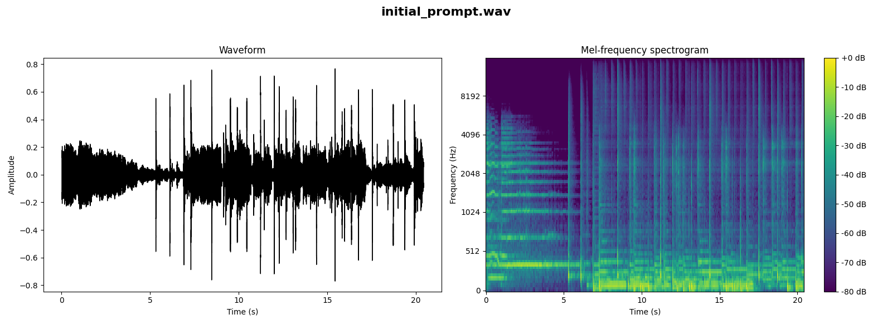

# Project Title

## Initial Prompt

<audio controls>
  <source src="initial_prompt.wav" type="audio/wav">
Your browser does not support the audio element.
</audio>

## Stem Content

### Vocals

<audio controls>
  <source src="path/to/vocals.wav" type="audio/wav">
Your browser does not support the audio element.
</audio>

### Bass

<audio controls>
  <source src="path/to/bass.wav" type="audio/wav">
Your browser does not support the audio element.
</audio>

### Drums

<audio controls>
  <source src="path/to/drums.wav" type="audio/wav">
Your browser does not support the audio element.
</audio>

### Other

<audio controls>
  <source src="path/to/other.wav" type="audio/wav">
Your browser does not support the audio element.
</audio>

## Iterations
### Example Iteration

<audio controls>
  <source src="path/to/iteration_audio.wav" type="audio/wav">
Your browser does not support the audio element.
</audio>

